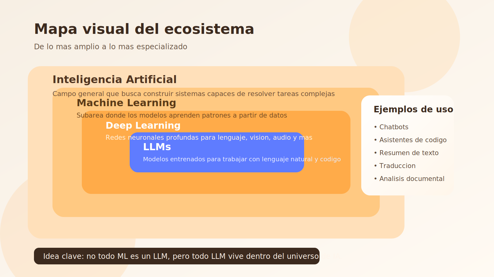
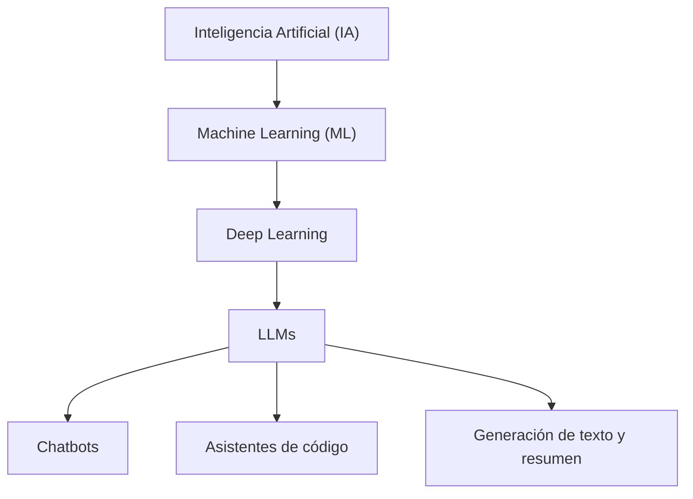
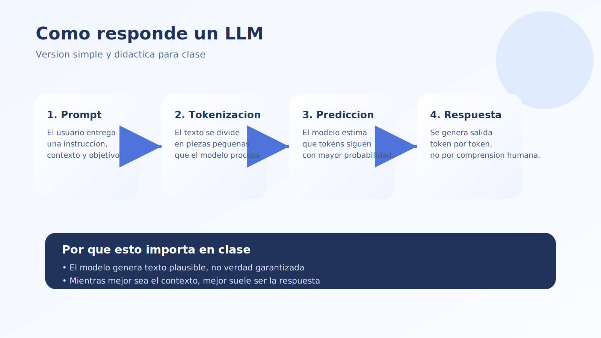
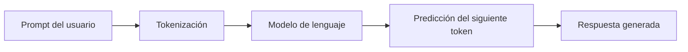
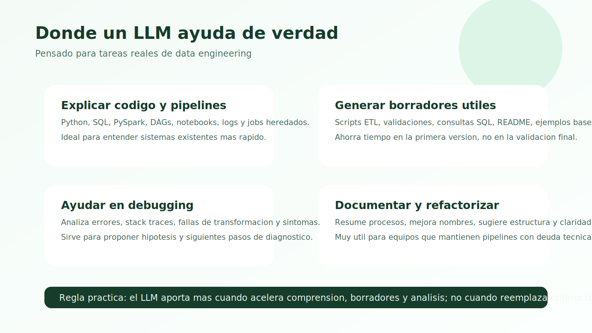
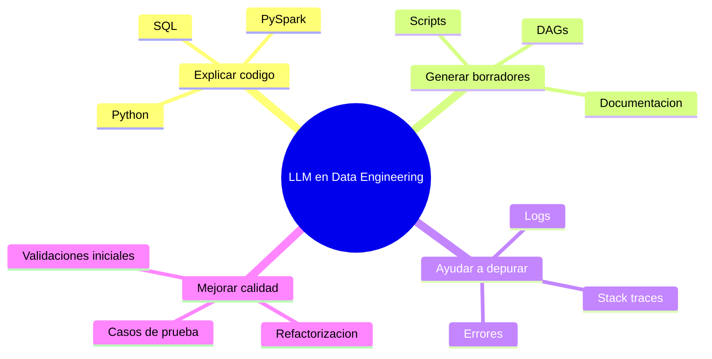
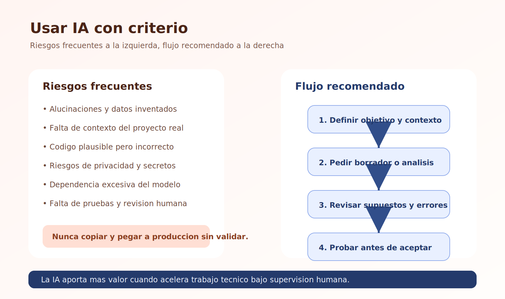
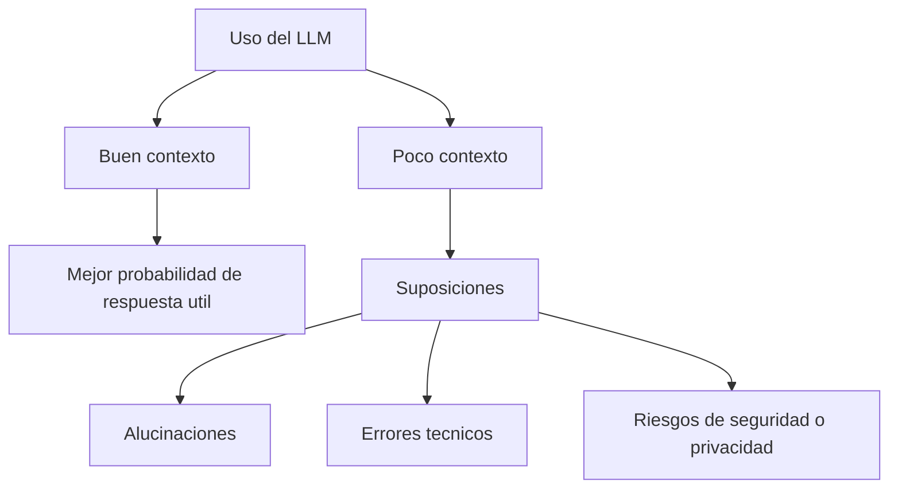
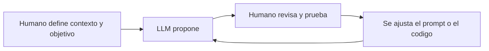

# Teoría - Módulo 01

## 1. IA, ML, deep learning y LLMs

### Mapa conceptual

### Inteligencia artificial

La inteligencia artificial es un campo amplio que busca construir sistemas capaces de realizar tareas que normalmente asociamos con capacidades humanas, como clasificar información, tomar decisiones, generar contenido o responder preguntas.

### Machine learning

El machine learning es una subárea de la IA donde los sistemas aprenden patrones a partir de datos. En lugar de programar todas las reglas manualmente, se entrena un modelo con ejemplos.

### Deep learning

El deep learning es un subconjunto del machine learning basado en redes neuronales profundas. Este enfoque permitió avances importantes en visión computacional, procesamiento de lenguaje natural y audio.

### LLMs

Los LLMs, o large language models, son modelos de lenguaje entrenados con grandes volúmenes de texto para predecir la siguiente palabra o token en una secuencia. A partir de esa capacidad, pueden resumir, explicar, traducir, generar código y mantener conversaciones útiles para tareas técnicas.

## 2. Cómo funciona un LLM a alto nivel

Un LLM no "piensa" como una persona ni consulta el conocimiento humano de forma consciente. Funciona detectando patrones estadísticos aprendidos durante el entrenamiento.

### Flujo simplificado de un LLM

Proceso simplificado:

1. Recibe una entrada en texto, también llamada prompt.
2. Convierte esa entrada en tokens.
3. Usa una arquitectura de red neuronal para estimar cuál es la siguiente secuencia más probable.
4. Genera una respuesta token por token.

Puntos importantes para clase:

- No entiende el mundo como un humano; predice secuencias plausibles.
- Puede producir respuestas muy convincentes aunque sean incorrectas.
- Su rendimiento depende mucho del contexto que recibe.
- Mejora bastante cuando la tarea está bien especificada.

## 3. Qué puede hacer bien un LLM en ingeniería de datos

### Ejemplos de uso en data engineering

Un LLM suele aportar valor en tareas como:

- Explicar código Python, SQL o PySpark.
- Proponer una primera versión de un script o pipeline.
- Sugerir refactorizaciones.
- Documentar procesos técnicos.
- Ayudar a depurar errores a partir de logs o stack traces.
- Convertir requerimientos ambiguos en pasos más concretos.
- Generar casos de prueba o validaciones iniciales.

## 4. Qué no hace bien

Es importante dejar claro desde el inicio que un LLM tiene límites:

- Puede inventar funciones, librerías o parámetros.
- Puede omitir supuestos críticos.
- Puede generar código que parece correcto pero falla en ejecución.
- No siempre conoce la estructura real de tu proyecto.
- Puede pasar por alto temas de seguridad, costo o rendimiento.
- No reemplaza pruebas, revisión de código ni validación funcional.

## 5. Riesgos y limitaciones

### Dónde aparecen los principales riesgos

### Alucinaciones

El modelo responde con información falsa o inventada presentada como si fuera correcta.

### Falta de contexto

Si el prompt no incluye suficiente contexto, el modelo rellena vacíos con suposiciones.

### Dependencia excesiva

Copiar respuestas sin entenderlas lleva a errores técnicos y a pérdida de criterio profesional.

### Riesgos de privacidad

No se deben compartir secretos, credenciales, datos sensibles o información confidencial sin controles adecuados.

### Sesgos y calidad variable

La calidad de la salida cambia según el modelo, el prompt y el tipo de tarea.

## 6. IA como asistente de desarrollo

La mejor manera de presentar la IA en este curso es como una herramienta de colaboración técnica.

### Modelo de colaboración recomendado

Modelo mental recomendado:

- El humano define objetivos, contexto y criterios de calidad.
- El LLM acelera exploración, redacción, generación de borradores y análisis.
- El humano valida, corrige, prueba y decide.

Esto aplica muy bien a ingeniería de datos porque muchas tareas son repetitivas, estructuradas y susceptibles de iteración: transformar datos, documentar pipelines, generar validaciones, escribir consultas o convertir reglas de negocio en lógica técnica.

## 7. Ideas clave para llevarse

- IA es el campo general.
- ML es una subárea que aprende a partir de datos.
- Deep learning es una técnica dentro de ML.
- LLM es un tipo de modelo especializado en lenguaje.
- Un LLM sirve como acelerador técnico, no como fuente incuestionable de verdad.
- El valor real aparece cuando combinamos contexto, criterio y verificación.
