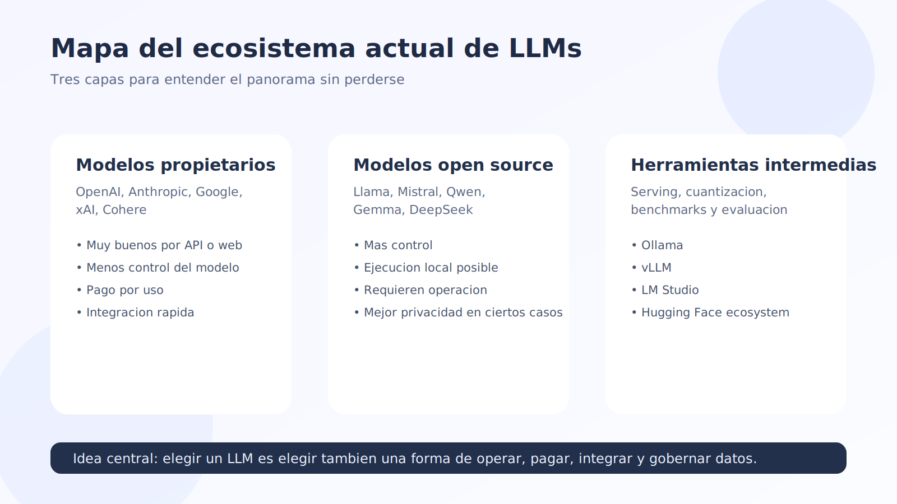
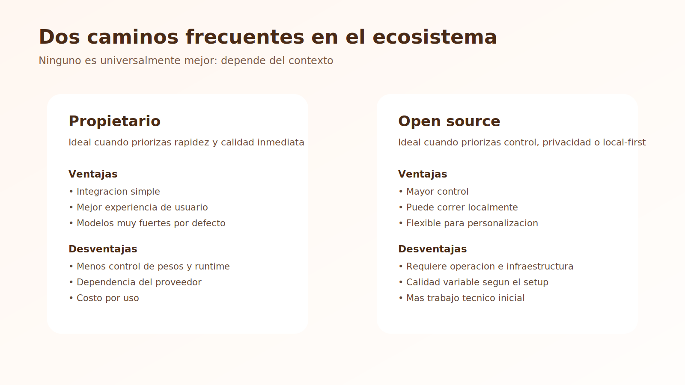
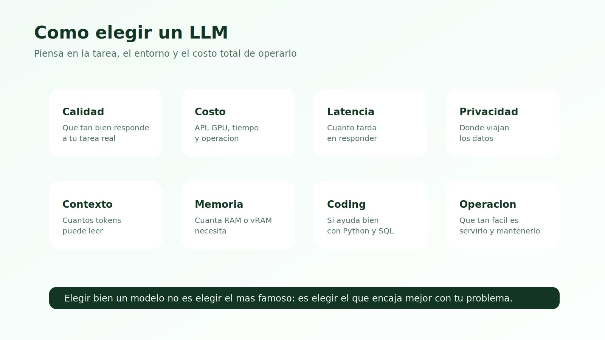
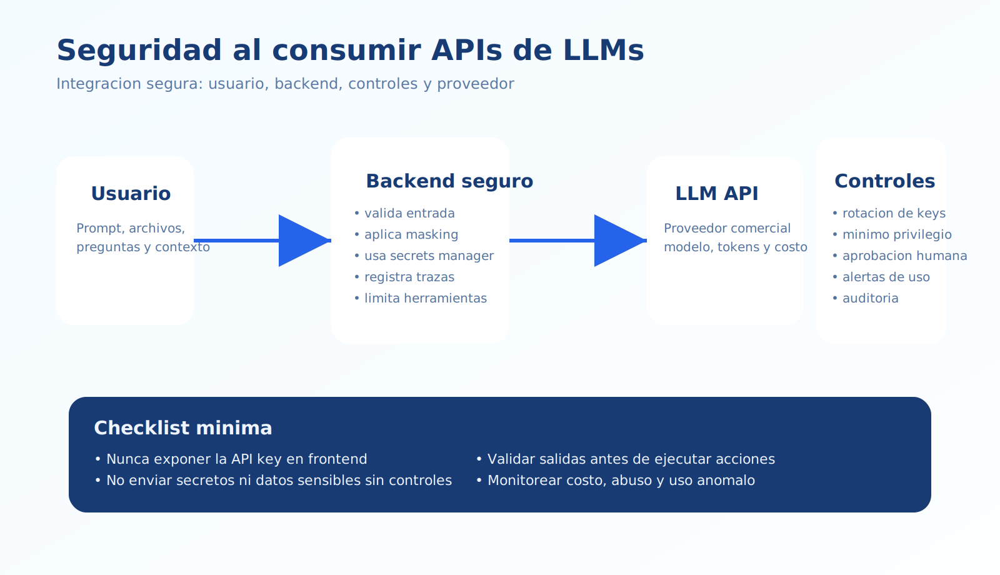
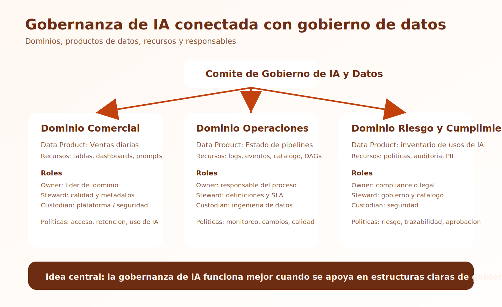
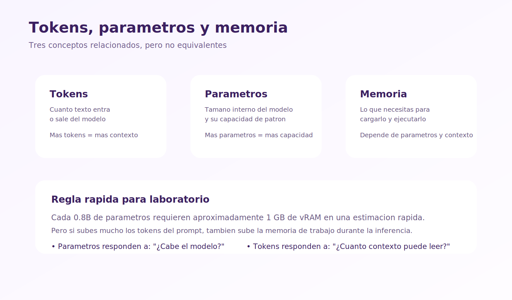

# Teoría - Módulo 02

## 1. Qué significa hablar del ecosistema de LLMs

Hoy no existe un solo modelo dominante para todos los casos de uso. En la práctica, el ecosistema de LLMs está compuesto por:

- plataformas propietarias accesibles vía web o API
- modelos open source que pueden descargarse y ejecutarse localmente
- herramientas intermedias para evaluar, servir o cuantizar modelos

Para un ingeniero de datos, el punto importante no es memorizar todos los nombres, sino entender cómo elegir el modelo correcto para una necesidad concreta.

## 2. LLMs propietarios

Los LLMs propietarios son modelos controlados por una empresa y ofrecidos como servicio.

Ejemplos comunes:

- OpenAI
- Anthropic
- Google
- xAI
- Cohere

### Ventajas

- muy buena experiencia de uso desde navegador o API
- modelos fuertes en calidad general
- actualizaciones frecuentes
- tooling maduro

### Desventajas

- dependencia del proveedor
- costo por uso
- menor control sobre pesos internos
- restricciones de privacidad o residencia de datos según caso

## 3. LLMs open source

Los modelos open source o de pesos abiertos permiten descargar variantes para correrlas localmente o en infraestructura propia.

Familias conocidas:

- Llama
- Mistral
- Qwen
- Gemma
- DeepSeek open models

### Ventajas

- más control del entorno
- posibilidad de ejecución local
- mejor opción para personalización y fine-tuning en ciertos casos
- flexibilidad para ambientes con restricciones de privacidad

### Desventajas

- requieren infraestructura y operación
- pueden necesitar cuantización, tuning o serving adicional
- no siempre igualan la experiencia de los proveedores cerrados

## 4. Cómo elegir un modelo

Al elegir un LLM conviene evaluar al menos estos factores:

- calidad general de respuesta
- razonamiento
- coding
- costo
- latencia
- tamaño de contexto
- privacidad
- posibilidad de correrlo localmente
- consumo de RAM o vRAM

## 4.1 Precios de referencia para LLMs usados vía API

Los precios cambian con frecuencia, así que conviene usar esta tabla solo como referencia inicial y revisar siempre la página oficial antes de tomar una decisión de arquitectura o presupuesto.

Fecha de referencia de esta tabla: `2026-03-21`.

Supuestos de la tabla:

- precios en USD
- referencia por `1 millón de tokens`
- se muestran precios base de texto
- no se incluyen descuentos por batch, caching, tiers especiales ni herramientas adicionales
- en Gemini 2.5 Pro se toma como referencia el tramo de prompts de hasta `200K` tokens

| Proveedor | Modelo | Input por 1M tokens | Output por 1M tokens | Comentario práctico |
| --- | --- | --- | --- | --- |
| OpenAI | GPT-4o mini | `$0.15` | `$0.60` | muy económico para tareas acotadas |
| OpenAI | GPT-4o | `$2.50` | `$10.00` | buen modelo general multimodal |
| OpenAI | GPT-5 mini | `$0.25` | `$2.00` | opción económica para prompts bien definidos |
| Anthropic | Claude Sonnet 4 | `$3.00` | `$15.00` | muy usado para coding y análisis |
| Anthropic | Claude Haiku 3.5 | `$0.80` | `$4.00` | opción rápida y más barata |
| Google | Gemini 2.5 Flash | `$0.30` | `$2.50` | buena relación costo-rendimiento |
| Google | Gemini 2.5 Pro | `$1.25` | `$5.00` | modelo más fuerte, especialmente en prompts complejos |
| DeepSeek | deepseek-chat | `$0.27` input cache miss | `$1.10` | muy competitivo en precio |
| DeepSeek | deepseek-reasoner | `$0.55` input cache miss | `$2.19` | pensado para modo reasoning |
| Mistral | Mistral Medium 3.1 | `$0.40` | `$2.00` | alternativa intermedia con buen costo |
| Mistral | Mistral Large 3 | `$0.50` | `$1.50` | modelo más capaz dentro de su familia |

### Cómo leer esta tabla en clase

- Si la tarea es simple y masiva, suele convenir mirar primero modelos baratos como `GPT-4o mini`, `Gemini 2.5 Flash`, `Claude Haiku` o `deepseek-chat`.
- Si la tarea exige mejor calidad general o coding más sólido, conviene evaluar `GPT-4o`, `Claude Sonnet` o `Gemini 2.5 Pro`.
- El precio por token no es todo: también importan latencia, calidad, contexto, privacidad y facilidad de integración.

## 5. Ejemplos de decisión práctica

### Caso A - Un analista necesita resumir documentación interna

Puede convenir un modelo propietario si:

- quiere rapidez
- no necesita operar infraestructura
- cuenta con políticas claras para uso de datos

### Caso B - Un equipo quiere usar IA en un entorno aislado

Puede convenir un modelo open source si:

- necesita ejecución local
- no quiere enviar datos a terceros
- tiene capacidad técnica para operar el modelo

### Caso C - Un ingeniero de datos quiere ayuda con scripts y SQL

Puede servir:

- un modelo propietario fuerte si prioriza calidad inmediata
- un modelo open source mediano si prioriza costo o privacidad

## 5.1 Medidas de seguridad al usar APIs de LLMs comerciales

Cuando un equipo usa APIs comerciales de LLM, el riesgo no está solo en el costo. También hay riesgos de fuga de secretos, exposición de datos, abuso de la API, mal uso de herramientas y problemas de cumplimiento.

### 1. Proteger las API keys

Reglas mínimas:

- nunca subir claves al repositorio
- nunca dejar claves hardcodeadas en código fuente
- nunca exponer claves directamente en frontend, navegador o apps móviles
- cargar las claves desde variables de entorno o un gestor de secretos
- rotar claves periódicamente

### 2. Usar llamadas server-side

La integración más segura suele ser:

- el usuario habla con tu aplicación
- tu backend valida la solicitud
- tu backend llama a la API del proveedor

Esto evita exponer la credencial del proveedor al cliente final.

### 3. Aplicar principio de mínimo privilegio

Siempre que la plataforma lo permita:

- separar proyectos de desarrollo, pruebas y producción
- limitar qué personas pueden ver, crear o rotar claves
- restringir permisos por equipo o proyecto
- eliminar claves y accesos que ya no se usan

### 4. Evitar enviar datos sensibles sin controles

Antes de enviar datos a un LLM comercial, conviene definir reglas sobre:

- credenciales
- datos personales
- datos financieros
- información confidencial del negocio
- código fuente sensible o propiedad intelectual crítica

Medidas prácticas:

- anonimizar o enmascarar datos
- filtrar PII antes de construir el prompt
- usar entornos aprobados por la organización
- mantener inventario de qué tipos de datos sí y no pueden enviarse

### 5. Validar entradas y salidas

No se debe confiar ciegamente en:

- prompts del usuario
- archivos subidos por el usuario
- texto proveniente de sitios externos
- respuestas generadas por el modelo

Buenas prácticas:

- sanear entradas
- limitar longitud y formato de prompts
- usar salidas estructuradas cuando sea posible
- validar JSON, SQL, código o comandos antes de ejecutarlos
- exigir aprobación humana en acciones sensibles

### 6. Protegerse contra prompt injection y uso inseguro de herramientas

Si el modelo puede usar herramientas, bases de datos, archivos o navegadores, el riesgo aumenta.

Medidas recomendadas:

- no dejar que texto no confiable dispare acciones automáticamente
- separar datos no confiables de instrucciones del sistema
- exigir confirmación humana para operaciones de escritura, borrado o ejecución
- limitar qué herramientas están disponibles para cada flujo
- registrar qué prompt, usuario y herramienta originaron cada acción

### 7. Monitorear costo, uso y abuso

Como las APIs comerciales cobran por uso, también hay un frente operativo:

- definir límites de gasto
- monitorear consumo por proyecto o aplicación
- alertar sobre picos anormales
- detectar uso fuera de horario o patrones sospechosos
- medir prompts ineficientes que generan costo innecesario

### 8. Trazabilidad y auditoría

En aplicaciones empresariales conviene registrar:

- usuario o sistema que hizo la solicitud
- modelo utilizado
- timestamp
- costo estimado o tokens usados
- versión del prompt o template
- resultado de validaciones y aprobaciones

Esto ayuda en seguridad, soporte, cumplimiento y mejora continua.

## 5.2 Principales lineamientos de gobernanza de IA

La gobernanza de IA no es solo una política legal. Es el conjunto de reglas con las que una organización decide cómo usar IA de forma segura, responsable y controlada.

### 1. Definir casos de uso permitidos y prohibidos

La organización debería clasificar:

- usos permitidos
- usos sensibles
- usos prohibidos

Ejemplo:

- permitido: resumir documentación técnica
- sensible: analizar datos internos con información personal
- prohibido: enviar secretos, datos regulados o decisiones críticas sin revisión humana

### 2. Clasificar el nivel de riesgo de cada aplicación

No todos los usos de IA tienen el mismo impacto.

Una clasificación simple podría separar:

- bajo riesgo
- riesgo medio
- alto riesgo

A mayor riesgo, más controles:

- revisión humana
- pruebas adicionales
- monitoreo
- aprobación formal

### 3. Asignar responsables

Toda solución con IA debería tener responsables claros:

- dueño del caso de uso
- responsable técnico
- responsable de seguridad o cumplimiento cuando aplique
- responsable de aprobar cambios importantes

### 4. Documentar prompts, modelos y flujos

La gobernanza mejora mucho cuando las soluciones no son cajas negras internas.

Conviene documentar:

- qué modelo se usa
- para qué proceso
- con qué datos
- qué prompt base o system prompt existe
- qué validaciones se aplican
- qué límites tiene el sistema

### 5. Mantener revisión humana en decisiones sensibles

En procesos críticos, la IA no debería decidir sola.

Ejemplos donde conviene human-in-the-loop:

- decisiones financieras
- aprobación de código productivo sin revisión
- decisiones sobre personas
- acciones automáticas con impacto legal o reputacional

### 6. Evaluar calidad, sesgo y seguridad de forma continua

No basta con probar una vez.

Se recomienda:

- usar conjuntos de pruebas
- revisar alucinaciones frecuentes
- medir errores por tipo de tarea
- evaluar sesgos
- repetir evaluaciones al cambiar modelo o prompt

### 7. Gestionar cambios de modelo

Los proveedores cambian versiones, precios y comportamientos.

Por eso conviene:

- versionar prompts y configuraciones
- probar antes de migrar de modelo
- revisar impacto en costo, calidad y seguridad
- evitar depender de una única versión sin plan de contingencia

### 8. Alinear IA con seguridad, privacidad y cumplimiento

La gobernanza de IA debe conectarse con políticas existentes de:

- seguridad de la información
- protección de datos
- gestión de accesos
- retención de información
- auditoría
- cumplimiento normativo

### Regla simple para clase

Si una organización usa IA en producción, debería poder responder con claridad estas preguntas:

1. ¿Qué modelo usamos y para qué?
2. ¿Qué datos le enviamos?
3. ¿Qué riesgos tiene ese uso?
4. ¿Qué controles implementamos?
5. ¿Quién responde si algo sale mal?

## 6. Tokens, contexto y parámetros

Cuando se comparan modelos, muchas personas mezclan tres ideas:

- tokens
- ventana de contexto
- parámetros

### Tokens

Son las piezas de texto que el modelo procesa.

### Ventana de contexto

Es la cantidad máxima de tokens que el modelo puede tener presentes en una interacción.

### Parámetros

Son los pesos internos del modelo. Influyen fuertemente en su capacidad y en la memoria necesaria para ejecutarlo.

## 6.1 Tokens vs parámetros del modelo

Es muy común confundir estos dos conceptos, pero miden cosas distintas:

- **Tokens**: cantidad de texto que entra o sale del modelo.
- **Parámetros**: cantidad de pesos internos que tiene el modelo.

Una forma simple de pensarlo:

- Los **tokens** representan cuánto texto puede procesar el modelo en una conversación o prompt.
- Los **parámetros** representan cuánta capacidad tiene el modelo para capturar patrones, conocimiento y comportamiento.

### Relación práctica entre ambos

No existe una relación directa del tipo:

> "más tokens = más parámetros"

porque son dimensiones diferentes.

Lo correcto sería pensar así:

- Un modelo con **más parámetros** suele tener más capacidad de razonamiento, mejor calidad de respuesta y mejor desempeño general.
- Un modelo con **más contexto en tokens** puede leer más texto antes de responder.
- Un modelo puede tener **muchos parámetros y poco contexto**, o **menos parámetros y mucho contexto**.

Por ejemplo:

- un modelo de `7B` puede venir con contexto de `8K`, `32K` o `128K` tokens
- un modelo de `1B` también puede tener una ventana de contexto grande, aunque no necesariamente responderá con la misma calidad que uno mayor

### Entonces, ¿cómo se relacionan con la memoria?

Aquí aparece la diferencia clave:

- Los **parámetros** determinan principalmente cuánta memoria hace falta para **cargar el modelo**.
- Los **tokens** determinan cuánta memoria adicional hace falta durante la **inferencia**, porque el modelo debe mantener contexto activo mientras procesa el prompt y genera la respuesta.

En términos prácticos:

- **más parámetros** -> más RAM o vRAM base para ejecutar el modelo
- **más tokens en el prompt** -> más memoria adicional durante la ejecución

### Regla rápida para clase

Como referencia general para inferencia local con modelos cuantizados:

- cada `0.8B` de parámetros requiere aproximadamente `1 GB` de vRAM para cargar el modelo

Esta es una **regla práctica**, no una ley exacta. La memoria real cambia según:

- cuantización usada (`4-bit`, `8-bit`, `fp16`, etc.)
- implementación del runtime
- longitud del contexto
- tamaño del lote
- uso de CPU, GPU o memoria compartida

### Idea clave

Cuando un estudiante pregunte "¿qué modelo cabe en mi equipo?", conviene separar siempre dos preguntas:

1. ¿Cuántos **parámetros** tiene el modelo?
2. ¿Cuántos **tokens de contexto** quiero usar?

La primera define la memoria base del modelo. La segunda aumenta la memoria de trabajo mientras el modelo está corriendo.

## 6.2 Referencia rápida de tamaño de modelo y memoria

La siguiente tabla usa la regla rápida:

- `vRAM aproximada = parámetros en billones / 0.8`

Es una estimación útil para clase y laboratorios locales. No incluye memoria extra para contexto largo, sistema operativo, framework ni batch.

| Parámetros (B) | LLMs de referencia | vRAM aproximada (GB) | CPU orientativa | ¿Para qué sirven? |
| --- | --- | --- | --- | --- |
| 0.8 | Qwen2.5-0.5B, TinyLlama 1.1B, Phi-3.5-mini | `~1 GB` | 4 | autocompletado básico, respuestas muy cortas, clasificación simple |
| 3 | Qwen2.5-3B, Phi-3-mini, SmolLM2-3B | `~4 GB` | 8 | redactar un email, resumir texto, explicar código corto |
| 7 | Mistral 7B, Qwen2.5-7B, Llama 3.x 8B | `~9 GB` | 12 | lo mismo que `3B`, pero mejor; razonamiento sencillo y mejor ayuda técnica |
| 14 | Qwen2.5-14B, Phi-4 14B, modelos equivalentes | `~18 GB` | 16 | mejor programación, análisis más consistente y tareas más exigentes |
| 70 | Llama 3.1/3.3 70B, Qwen2.5-72B | `~88 GB` | 64 | tareas complejas, alta calidad general, análisis y generación técnica avanzada |

### Ejemplos simples para recordar

- Modelos con `0.8B` de parámetros necesitan cerca de `1 GB` de vRAM. Pueden funcionar en dispositivos muy pequeños.
- Modelos con `3B` de parámetros necesitan cerca de `4 GB`. Sirven para redactar un email, resumir texto o explicar código simple.
- Modelos con `7B` de parámetros necesitan cerca de `9 GB`. Hacen lo mismo que `3B`, pero mejor y con razonamiento sencillo.
- Modelos con `14B` de parámetros necesitan cerca de `18 GB`. Ya permiten tareas más exigentes de programación y análisis.

### Nota importante sobre memoria real

En modelos reales, la memoria exacta puede variar bastante por cuantización. Además, los tokens del prompt consumen memoria adicional aparte de la necesaria para cargar el modelo.

## 7. Regla mental útil

Una forma rápida de pensar el ecosistema es esta:

- modelos pequeños: más baratos y fáciles de correr
- modelos medianos: buen balance para tareas generales
- modelos grandes: mejor calidad, pero mayor costo e infraestructura

## 8. Idea clave para ingeniería de datos

Elegir un LLM es una decisión de arquitectura. No se trata solo de "qué responde mejor", sino de qué encaja mejor con:

- el tipo de tarea
- el flujo de trabajo
- los costos
- la seguridad
- el entorno técnico del equipo
