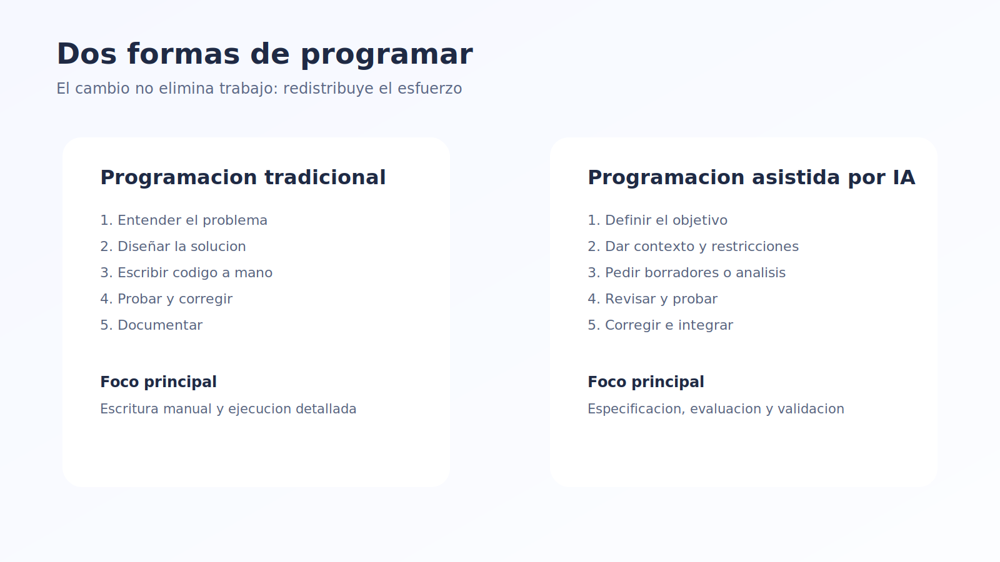
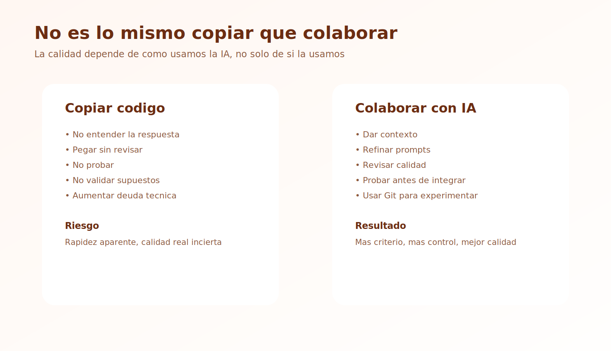
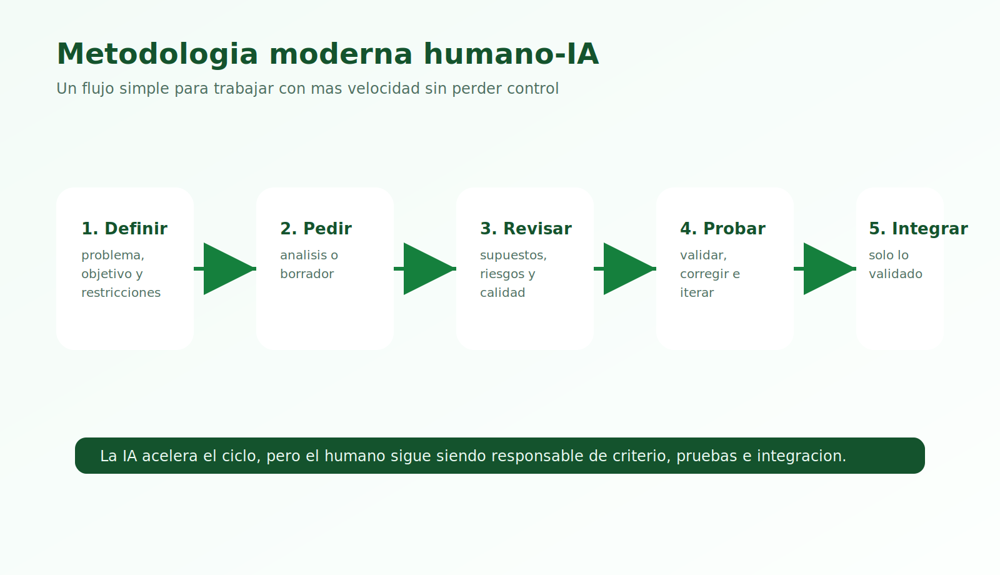
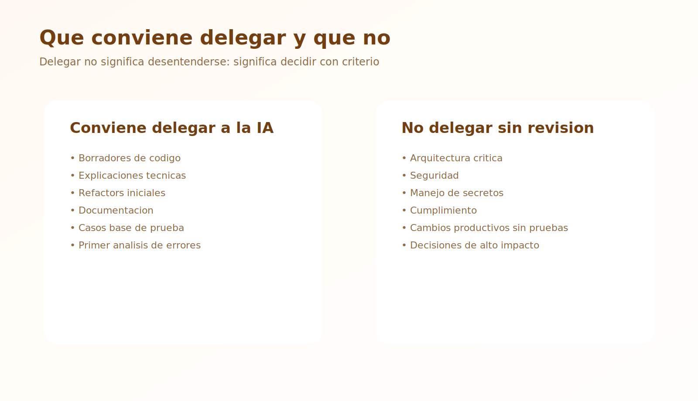

# Teoría - Módulo 05

## 1. Programación tradicional

En la programación tradicional, el desarrollador suele:

- pensar el problema
- diseñar la solución
- escribir el código manualmente
- probar
- corregir
- documentar

Todo el ciclo recae principalmente en la persona. Las herramientas ayudan, pero no proponen demasiado por sí solas.

## 2. Programación asistida por IA

En la programación asistida por IA, parte de ese trabajo se redistribuye.

Ahora el desarrollador puede:

- definir el objetivo
- dar contexto
- pedir borradores de código
- pedir explicaciones
- iterar soluciones
- revisar y validar resultados

La IA acelera muchas etapas, pero no reemplaza el criterio técnico.

## 3. Diferencia entre copiar código y colaborar con IA

Hay una diferencia importante entre:

- copiar una respuesta y pegarla sin entenderla

y:

- usar la IA como colaborador técnico

Colaborar con IA implica:

- hacer preguntas buenas
- refinar instrucciones
- revisar supuestos
- contrastar resultados
- probar lo generado

## 4. Qué cambia en el trabajo del desarrollador

Con IA, el trabajo no desaparece. Cambia.

Antes el foco estaba más en:

- escribir línea por línea

Ahora el foco se desplaza hacia:

- especificar mejor
- dividir problemas
- evaluar salidas
- validar calidad
- integrar resultados

## 5. Ventajas de la programación asistida por IA

### Aceleración

Permite avanzar más rápido en:

- borradores
- documentación
- análisis inicial
- refactors
- generación de casos base

### Exploración

Ayuda a probar varias ideas rápidamente.

### Soporte contextual

Puede explicar código, errores, logs o arquitecturas existentes.

## 6. Riesgos de la programación asistida por IA

### Dependencia excesiva

Si el desarrollador deja de pensar críticamente, baja la calidad real del trabajo.

### Falsa sensación de corrección

La IA puede responder con mucha seguridad incluso cuando se equivoca.

### Pérdida de contexto

Si no se da suficiente información, la respuesta puede ser superficial o incorrecta.

### Deuda técnica más rápida

La IA puede acelerar también la creación de código pobre si no hay revisión.

## 7. Una metodología moderna de trabajo humano-IA

Una metodología útil podría verse así:

1. definir claramente el problema
2. pedir análisis o propuesta
3. pedir una primera versión
4. revisar supuestos y calidad
5. probar
6. corregir e iterar
7. integrar solo lo que ya fue validado

## 8. Qué conviene delegar a la IA

Suele ser buena idea delegar:

- borradores de código
- explicaciones
- refactorizaciones iniciales
- documentación
- generación de casos base
- primeros diagnósticos de errores

## 9. Qué no conviene delegar completamente

No conviene delegar sin revisión:

- decisiones de arquitectura críticas
- cambios productivos sin pruebas
- seguridad
- cumplimiento
- manejo de secretos
- decisiones con impacto alto en negocio o personas

## 10. Perfil del desarrollador moderno

El desarrollador que trabaja bien con IA no es el que menos sabe, sino el que mejor sabe:

- pedir
- evaluar
- decidir
- integrar
- corregir

## 11. Ideas clave para llevarse

- programar con IA no es lo mismo que copiar código
- la IA acelera, pero no reemplaza validación
- el valor del humano se mueve hacia especificación y criterio
- una buena metodología humano-IA reduce errores y mejora productividad
