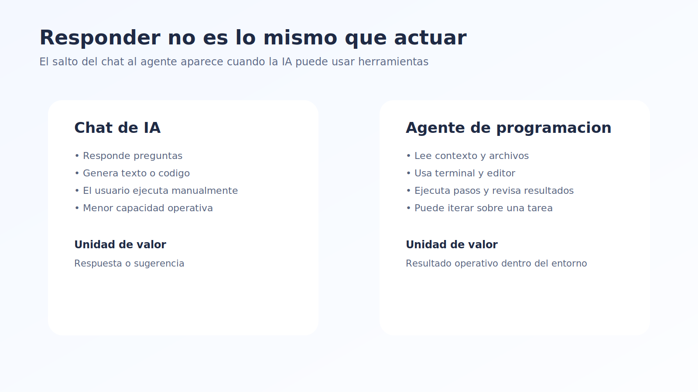
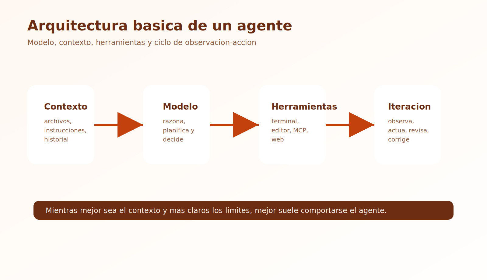
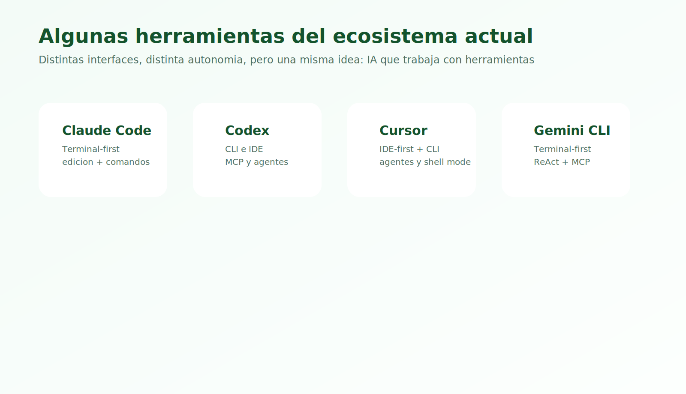

# Teoría - Módulo 06

## 1. ¿Qué es un agente de programación?

Un agente de programación es un sistema basado en IA que no solo genera respuestas en lenguaje natural, sino que también puede actuar dentro de un entorno de trabajo para completar tareas técnicas.

Eso puede incluir:

- leer archivos
- buscar en un código fuente
- proponer cambios
- editar archivos
- ejecutar comandos
- revisar resultados
- iterar hasta llegar a un objetivo

## 2. Diferencia entre chat con IA y agente

### Chat con IA

Un chat tradicional con IA normalmente:

- responde preguntas
- genera texto o código
- depende de que el usuario copie, pegue y ejecute

### Agente de programación

Un agente puede ir un paso más allá:

- inspeccionar el proyecto
- decidir próximos pasos
- ejecutar acciones
- revisar errores
- corregir y volver a intentar

## 3. Modelo mental simple

Una forma fácil de explicarlo es esta:

- un chat responde
- un agente trabaja

Eso no significa que sea completamente autónomo o infalible, pero sí que tiene más capacidad operativa dentro de una tarea.

## 4. Arquitectura básica de un agente

Aunque cada herramienta lo implementa distinto, muchos agentes comparten componentes como:

- modelo de lenguaje
- memoria o contexto
- plan o descomposición de tareas
- herramientas
- ciclo de observación y acción

## 5. Componentes principales

### Modelo

Es el motor de razonamiento o generación.

### Contexto

Incluye:

- instrucciones del sistema
- archivos del proyecto
- historial de conversación
- resultados anteriores

### Herramientas

Son las capacidades operativas del agente, por ejemplo:

- terminal
- editor de archivos
- navegador
- acceso a documentación
- ejecución de tests

### Bucle de trabajo

Muchos agentes operan con un ciclo parecido a:

1. observar el estado actual
2. decidir siguiente acción
3. usar una herramienta
4. revisar el resultado
5. iterar

## 6. Qué pueden hacer bien los agentes de programación

En general suelen ser útiles para:

- explorar un repositorio
- implementar cambios pequeños o medianos
- refactorizar
- diagnosticar errores
- escribir pruebas
- actualizar documentación

## 7. Qué no hacen bien todavía

Los agentes actuales todavía tienen límites importantes:

- pueden tomar decisiones erróneas
- pueden malinterpretar contexto
- pueden romper cosas al hacer cambios amplios
- no entienden prioridades del negocio por sí solos
- no reemplazan revisión humana

## 8. Niveles de autonomía

No todos los agentes son igual de autónomos.

Podemos pensar en un espectro:

- sugerencia asistida
- edición guiada
- ejecución semiautónoma
- automatización más amplia bajo supervisión

## 9. Herramientas actuales del ecosistema

Ejemplos de herramientas que suelen aparecer en este espacio:

- Claude Code
- OpenCode
- Codex / Codex Agents
- OpenDevin
- Cursor con capacidades agentic

No todas funcionan igual. Algunas están más orientadas a chat dentro del editor; otras están más orientadas a ejecutar tareas completas sobre un repositorio.

## 9.1 Cuadro comparativo de agentes populares

La siguiente tabla resume, a alto nivel, cómo se posicionan algunas herramientas conocidas en el trabajo diario de desarrollo.

| Herramienta | Enfoque principal | Dónde vive mejor | Qué hace bien | Limitación típica |
| --- | --- | --- | --- | --- |
| Claude Code | agente terminal-first | terminal y repo local | explorar código, editar archivos, ejecutar comandos, automatizar tareas repetitivas | depende mucho del contexto y de buenos límites |
| Codex | agente de coding de OpenAI | CLI, IDE y flujos con MCP | tareas agentic, integración con MCP, trabajo sobre repos y documentación | requiere definir bien el alcance para evitar trabajo innecesario |
| Cursor | IDE-first con capacidades agentic | editor + CLI | pair programming, edición asistida, agentes dentro del entorno de desarrollo | muy cómodo en editor, pero puede inducir dependencia si no se revisa |
| Gemini CLI | agente terminal-first de Google | terminal, Cloud Shell y VS Code vía agent mode | usar herramientas, MCP, bug fixing y tareas largas en terminal | su experiencia depende bastante del entorno y la configuración |

## 9.2 ¿Para qué sirve la CLI de cada uno?

Las CLI importan porque llevan el agente al lugar donde muchos desarrolladores ya trabajan: el terminal.

### Claude Code CLI

La CLI de Claude Code sirve para:

- trabajar directamente sobre un repositorio desde terminal
- pedir implementación de features desde descripciones
- diagnosticar bugs y aplicar fixes
- ejecutar comandos y editar archivos
- automatizar tareas repetitivas o de CI

### Codex CLI

La CLI de Codex sirve para:

- trabajar con agentes de código desde terminal
- conectar servidores MCP y reutilizar contexto entre CLI e IDE
- hacer búsqueda, edición y tareas agentic sobre el repo
- integrar documentación u otras fuentes vía MCP

### Cursor CLI

La CLI de Cursor sirve para:

- usar agentes desde terminal fuera del editor
- ejecutar flujos headless y automatizaciones
- aprovechar shell mode y scripts
- integrar agentes en workflows como GitHub Actions o tareas automatizadas

### Gemini CLI

La CLI de Gemini sirve para:

- acceder a Gemini directamente desde terminal
- usar un ciclo ReAct con herramientas del sistema
- conectar servidores MCP locales o remotos
- arreglar bugs, crear features y mejorar tests
- extender la experiencia de Gemini Code Assist agent mode

## 10. Riesgos al trabajar con agentes

### Riesgo técnico

Pueden introducir bugs o cambios inconsistentes.

### Riesgo operativo

Pueden ejecutar acciones no deseadas si el alcance no está bien definido.

### Riesgo de contexto

Si no tienen suficiente contexto, pueden resolver el problema equivocado.

### Riesgo de confianza excesiva

Es fácil pensar que “si el agente lo hizo, debe estar bien”, y ese es un error.

## 11. Buenas prácticas al usar agentes

- definir tareas concretas
- limitar el alcance
- revisar cambios
- usar Git y ramas
- ejecutar pruebas
- pedir explicaciones cuando haga algo importante

## 12. Ideas clave para llevarse

- un agente de programación combina IA con capacidad de acción
- la diferencia no es solo generar código, sino operar sobre un entorno
- los agentes son útiles, pero requieren supervisión
- cuanto mejor sea el contexto y los límites, mejor funciona el agente
