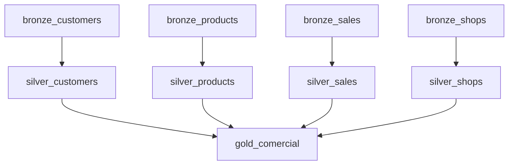

# Ejercicio 01 - Orquestar el pipeline PySpark con un DAG de Airflow usando agentes

## Objetivo

Usar agentes de IA para desarrollar un DAG de Airflow que orqueste el pipeline construido en el módulo 11 sobre el proyecto `multihope`.

El DAG debe coordinar:

- el flujo ya existente de `customers`
- carga `raw -> bronze` para `products`, `sales` y `shops`
- limpieza `bronze -> silver` para `products`, `sales` y `shops`
- consolidación final de la tabla `comercial` en `gold`

## Duración sugerida

50 a 70 minutos

## Contexto

Este laboratorio continúa directamente el trabajo del módulo 11. No se trata de crear un DAG aislado, sino de orquestar el pipeline que ya fue diseñado e implementado en el proyecto.

## Herramientas permitidas

Todo el ejercicio debe hacerse con **agentes de IA**. Puedes usar uno o varios de estos:

- Claude Code
- Codex
- Gemini CLI
- OpenCode

## Parte A - Preparar el contexto del proyecto

Trabaja sobre el mismo repositorio personal que usaste en el módulo 11, idealmente en la rama `dev` o en una rama derivada de ella para el trabajo de Airflow.

Antes de pedir código al agente, asegúrate de tener claro:

- dónde están los scripts PySpark creados en el tema 11
- cómo está implementado actualmente el flujo de `customers`
- qué notebooks sirven como apoyo o validación
- qué tabla final se genera en `gold`
- qué dependencias existen entre las etapas

## Parte B - Pedir al agente una propuesta de orquestación

Primero pide al agente que no escriba código todavía. Que te proponga el diseño lógico del DAG.

### Prompt base sugerido

```markdown
# Rol
Actúa como un arquitecto de datos experto en Airflow y PySpark.

# Contexto
Tengo un proyecto de ingeniería de datos con un flujo:
- `raw -> bronze -> silver` ya implementado para `customers`
- `raw -> bronze` para `products`, `sales` y `shops`
- `bronze -> silver` para `products`, `sales` y `shops`
- consolidación final `gold/comercial` usando también `customers`

# Objetivo
Ayúdame a diseñar un DAG de Airflow para orquestar este pipeline.

# Requisitos
- no escribas código todavía
- define tareas claras
- explica dependencias entre tareas
- sugiere una estructura simple y mantenible
- considera que el proyecto ya existe y no quiero una solución genérica

# Formato de salida
1. lista de tareas
2. orden de ejecución
3. dependencias
4. recomendaciones de implementación
```

## Parte C - Definir las tareas del DAG

Como mínimo, el DAG debe contemplar tareas equivalentes a estas:

- `bronze_customers`
- `silver_customers`
- `bronze_products`
- `bronze_sales`
- `bronze_shops`
- `silver_products`
- `silver_sales`
- `silver_shops`
- `gold_comercial`

Si el agente propone tareas auxiliares adicionales, deben estar justificadas.

### Grafo de referencia del DAG

Antes de pedir el archivo Python del DAG, usa este diagrama como referencia visual del flujo esperado:



### Cómo interpretar el gráfico

- cada nodo representa una tarea del DAG
- `customers` ya existe en el proyecto y debe usarse como referencia para replicar el patrón en las demás tablas
- las tareas `bronze_*` deben ejecutarse antes que sus correspondientes `silver_*`
- la tarea `gold_comercial` depende de que todas las tablas `silver` necesarias hayan sido generadas correctamente
- la tabla `customers` también forma parte del flujo que alimenta `gold_comercial`

## Parte D - Pedir el archivo del DAG

Una vez validado el diseño, pide al agente que genere el archivo Python del DAG.

### Qué debe incluir el DAG

- un nombre claro para el DAG
- `start_date`
- `schedule` o ejecución manual
- tareas bien nombradas
- dependencias correctas
- comentarios mínimos útiles

### Prompt base sugerido

```markdown
# Rol
Actúa como un ingeniero de datos senior experto en Airflow.

# Contexto
Ya tengo definido el pipeline PySpark del proyecto. El flujo de `customers` ya existe y debo replicar ese patrón para `products`, `sales` y `shops`, además de orquestar la consolidación final.

# Objetivo
Genera el archivo Python del DAG de Airflow para orquestar el flujo completo.

# Requisitos
- usa una estructura simple y mantenible
- refleja tareas reales del proyecto
- toma como referencia el flujo existente de `customers`
- modela correctamente las dependencias entre `bronze`, `silver` y `gold`
- usa nombres de tareas claros
- agrega comentarios mínimos útiles
- el DAG debe poder entenderse fácilmente al leerlo

# Formato de salida
1. ruta sugerida del archivo
2. código completo del DAG
3. explicación breve del flujo
```

## Parte E - Revisar el DAG con un agente

Después de generar el archivo, pide una revisión crítica.

Debes solicitarle al agente que evalúe:

- orden correcto de tareas
- dependencias faltantes o sobrantes
- nombres confusos
- supuestos no explícitos
- riesgos técnicos del DAG

### Prompt sugerido

```markdown
# Rol
Actúa como revisor técnico de Airflow.

# Objetivo
Revisa este DAG y detecta:
- dependencias incorrectas
- tareas innecesarias
- errores de diseño
- mejoras de legibilidad y mantenimiento

# Restricciones
- prioriza problemas reales
- evita recomendaciones genéricas
- justifica cada observación
```

## Parte F - Validar la trazabilidad del flujo

El estudiante debe poder explicar, usando el DAG:

1. qué tareas construyen `bronze`
2. qué tareas construyen `silver`
3. cómo el flujo de `customers` sirve de patrón para las demás tablas
4. por qué `gold_comercial` debe ejecutarse al final
5. qué ocurriría si una tarea `silver` falla

## Parte G - Actividad adicional opcional

Si hay tiempo, pide al agente una mejora adicional como una de estas:

- agrupar tareas por capa con una estructura más clara
- agregar documentación en el DAG
- proponer una versión con validaciones previas o posteriores
- sugerir cómo pasar parámetros o rutas de manera más ordenada

## Parte H - Evidencia esperada

El estudiante debe dejar evidencia de:

- análisis del pipeline previo
- diseño lógico de tareas
- archivo Python del DAG
- revisión hecha por un agente de IA
- justificación del orden y dependencias

## Entregable

Debe presentar:

1. ruta del archivo DAG dentro del proyecto
2. nombre del DAG
3. lista de tareas incluidas
4. explicación breve del orden de ejecución
5. evidencia de uso de agentes de IA
6. revisión crítica del DAG

## Criterio de éxito

El ejercicio está completo si el estudiante logra:

- traducir el pipeline del tema 11 a tareas orquestadas
- construir un DAG coherente con el proyecto
- usar agentes de IA para diseñar, generar y revisar el DAG
- explicar claramente cómo se coordina el flujo completo de datos
