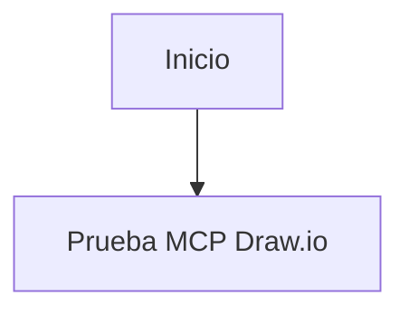
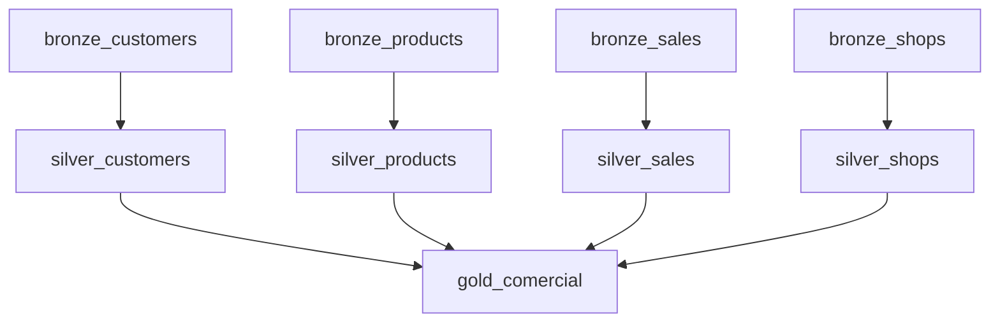

# Ejercicio 01 - Instalar draw.io MCP y diagramar el flujo del DAG

## Objetivo

Instalar el MCP oficial de draw.io y usarlo desde Claude Code para generar un diagrama visual del flujo de datos orquestado en el tema 12.

El resultado esperado es un diagrama que represente:

- `bronze_customers`
- `bronze_products`
- `bronze_sales`
- `bronze_shops`
- `silver_customers`
- `silver_products`
- `silver_sales`
- `silver_shops`
- `gold_comercial`

## Duración sugerida

35 a 50 minutos

## Repositorio oficial

- [jgraph/drawio-mcp](https://github.com/jgraph/drawio-mcp)

## Qué vamos a instalar

Para Claude Code, la documentación oficial recomienda usar el MCP Tool Server publicado como:

- `@drawio/mcp`

Según la documentación oficial del repositorio, la forma recomendada de configurarlo en Claude Code es:

```text
claude mcp add drawio -- npx -y @drawio/mcp
```

Fuente oficial:

- [Draw.io MCP Tool Server README](https://github.com/jgraph/drawio-mcp/blob/main/mcp-tool-server/README.md)

## Requisitos previos

- Node.js instalado
- Claude Code funcionando
- acceso al proyecto trabajado en el tema 12

## Parte A - Instalar el MCP de draw.io

Abre la terminal y ejecuta:

```bash
claude mcp add drawio -- npx -y @drawio/mcp
```

### Qué hace este comando

- registra un servidor MCP llamado `drawio`
- usa `npx` para ejecutar el paquete oficial `@drawio/mcp`
- deja la integración lista para que Claude Code pueda usar las herramientas del servidor

## Parte B - Alternativa manual

Si quieres revisar la configuración manualmente, la documentación oficial indica que también puede declararse en `.claude/settings.json` con una estructura como esta:

```json
{
  "mcpServers": {
    "drawio": {
      "command": "npx",
      "args": ["-y", "@drawio/mcp"]
    }
  }
}
```

En este laboratorio, la opción recomendada es el comando `claude mcp add`, porque es más simple y menos propensa a errores.

## Parte C - Qué herramientas expone el MCP

La documentación oficial del servidor indica que este MCP expone al menos estas herramientas:

- `open_drawio_xml`
- `open_drawio_csv`
- `open_drawio_mermaid`

Para este ejercicio vamos a usar:

- `open_drawio_mermaid`

porque el flujo del tema 12 ya está modelado de forma muy cercana a un grafo.

## Parte D - Validar que el MCP fue instalado correctamente

Antes de diagramar el flujo completo del tema 12, realiza una prueba mínima.

Abre Claude Code y usa este prompt:

````markdown
Usa la herramienta `open_drawio_mermaid` para abrir este diagrama:


````

### Qué deberías observar

Si el MCP está bien instalado, Claude Code debería:

- detectar la herramienta `open_drawio_mermaid`
- ejecutar el servidor `drawio`
- abrir o generar el diagrama de prueba

Si esta prueba funciona, entonces ya puedes pasar al diagrama completo del DAG.

## Parte E - Definir el flujo que se va a diagramar

Antes de invocar el MCP, toma como referencia el DAG del tema 12.

El flujo base debe representar:



## Parte F - Pedir al agente que use el MCP

Ahora abre Claude Code y dale una instrucción explícita para que use la herramienta `open_drawio_mermaid`.

### Prompt base sugerido

```markdown
# Rol
Actúa como un arquitecto de datos.

# Objetivo
Usa la herramienta `open_drawio_mermaid` del MCP de draw.io para generar un diagrama del flujo de datos del proyecto.

# Contexto
El flujo representa el DAG del tema 12 y contiene estas tareas:
- bronze_customers -> silver_customers
- bronze_products -> silver_products
- bronze_sales -> silver_sales
- bronze_shops -> silver_shops
- todas las tablas silver alimentan gold_comercial

# Requisito
Genera el diagrama en draw.io a partir de Mermaid y ábrelo para revisión.
```

## Parte G - Ajustar el diagrama

Una vez que el MCP abra el diagrama, revisa:

- si las dependencias son correctas
- si los nombres coinciden con el DAG
- si `customers` aparece como patrón existente del proyecto
- si `gold_comercial` está correctamente al final

Si hace falta, pide al agente una segunda versión del Mermaid con:

- mejor orden visual
- agrupación por capa
- nombres más legibles

## Parte H - Abrir el archivo `.drawio` en Visual Studio Code

Además del uso del MCP, en este ejercicio también vas a preparar Visual Studio Code para abrir archivos `.drawio`.

### Extensión recomendada

Instala la extensión:

- [Draw.io Integration](https://github.com/hediet/vscode-drawio)

### Qué permite esta extensión

Según el repositorio oficial del plugin, esta extensión permite trabajar con archivos draw.io directamente desde Visual Studio Code.

En este laboratorio nos interesa especialmente poder abrir y revisar archivos como:

- `.drawio`
- `.dio`
- `.drawio.svg`
- `.drawio.png`

Para este laboratorio nos interesa especialmente el formato:

- `.drawio`

### Pasos sugeridos

1. abre Visual Studio Code
2. entra en la pestaña de extensiones
3. busca `Draw.io Integration`
4. verifica que el publicador sea `hediet`
5. instala la extensión

### Actividad práctica

Una vez generado el diagrama con ayuda del MCP, guarda o ubica el archivo `.drawio` dentro del proyecto y ábrelo en Visual Studio Code.

El objetivo es que puedas:

- visualizar el grafo localmente
- revisar nombres de tareas
- confirmar dependencias
- dejar el diagrama como parte de la documentación técnica del proyecto

## Parte I - Validación final

El estudiante debe comprobar:

- que la prueba mínima `A -> B` funcionó
- que el MCP generó el diagrama correctamente
- que Visual Studio Code puede abrir el archivo `.drawio`
- que el flujo visual coincide con el DAG del tema 12
- que `customers` aparece como patrón existente y `gold_comercial` como resultado final

## Parte J - Mejora opcional

Si hay tiempo, pide un diagrama más expresivo que separe visualmente:

- capa `bronze`
- capa `silver`
- capa `gold`

Por ejemplo, puedes pedirle al agente que use subgrafos lógicos o una organización por niveles.

## Entregable

El estudiante debe presentar:

1. evidencia de instalación del MCP `drawio`
2. evidencia de instalación de la extensión `Draw.io Integration` en Visual Studio Code
3. evidencia de la prueba mínima `A -> B`
4. el prompt usado en Claude Code
5. el diagrama generado
6. una breve explicación del flujo representado

## Criterio de éxito

El ejercicio está completo si el estudiante logra:

- instalar correctamente `@drawio/mcp`
- instalar la extensión `Draw.io Integration` en Visual Studio Code
- validar el MCP con el diagrama mínimo de prueba
- usar `open_drawio_mermaid` desde Claude Code
- generar un diagrama visual del flujo del DAG
- abrir el archivo `.drawio` en Visual Studio Code
- verificar que el diagrama coincide con el pipeline del tema 12
