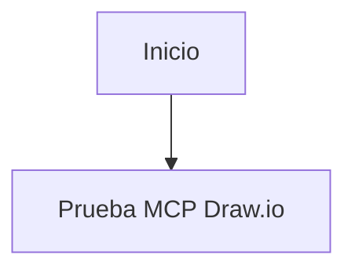
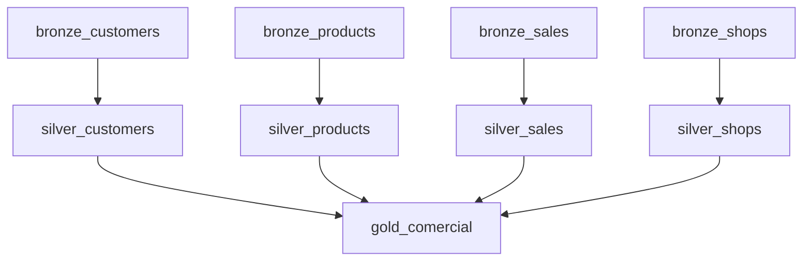

# Ejercicio 02 - Instalar draw.io MCP en OpenCode y diagramar el flujo del DAG

## Objetivo

Instalar el mismo MCP oficial de draw.io, pero esta vez en **OpenCode**, y usarlo para generar un diagrama visual del flujo de datos orquestado en el tema 12.

El resultado esperado sigue siendo un diagrama que represente:

- `bronze_customers`
- `bronze_products`
- `bronze_sales`
- `bronze_shops`
- `silver_customers`
- `silver_products`
- `silver_sales`
- `silver_shops`
- `gold_comercial`

## Duración sugerida

30 a 45 minutos

## Repositorio oficial

- [jgraph/drawio-mcp](https://github.com/jgraph/drawio-mcp)

## Requisitos previos

- Node.js instalado
- OpenCode funcionando
- acceso al proyecto trabajado en el tema 12

## Cómo se configura MCP en OpenCode

La documentación oficial de OpenCode indica que los servidores MCP se configuran en `opencode.json` mediante la clave `mcp`.

Un servidor local se declara con una estructura como:

```json
{
  "$schema": "https://opencode.ai/config.json",
  "mcp": {
    "nombre-del-servidor": {
      "type": "local",
      "command": ["comando", "arg1", "arg2"]
    }
  }
}
```

Referencia oficial:

- [OpenCode Configuration](https://opencode.ai/docs/config/)

## Parte A - Crear o editar `opencode.json`

En la raíz del proyecto crea o edita el archivo:

```text
opencode.json
```

Y agrega la configuración del MCP de draw.io así:

```json
{
  "$schema": "https://opencode.ai/config.json",
  "mcp": {
    "drawio": {
      "type": "local",
      "command": ["npx", "-y", "@drawio/mcp"]
    }
  }
}
```

## Parte B - Qué hace esta configuración

Esta configuración le dice a OpenCode que:

- registre un servidor MCP llamado `drawio`
- lo ejecute localmente
- use `npx` para lanzar el paquete oficial `@drawio/mcp`

En la práctica, es el equivalente del ejercicio 01 en Claude Code, pero con el mecanismo de configuración propio de OpenCode.

## Parte C - Reiniciar OpenCode

Después de guardar `opencode.json`, vuelve a abrir OpenCode dentro del proyecto para que detecte la nueva configuración.

## Parte D - Qué herramientas expone el MCP

Al igual que en Claude Code, este MCP expone herramientas como:

- `open_drawio_xml`
- `open_drawio_csv`
- `open_drawio_mermaid`

Para este laboratorio vamos a usar:

- `open_drawio_mermaid`

## Parte E - Validar que el MCP fue instalado correctamente

Antes de diagramar el flujo completo del tema 12, realiza una prueba mínima en OpenCode.

Usa este prompt:

````markdown
Usa la herramienta `open_drawio_mermaid` para abrir este diagrama:


````

### Qué deberías observar

Si el MCP está bien configurado, OpenCode debería:

- detectar la herramienta `open_drawio_mermaid`
- ejecutar el servidor `drawio`
- abrir o generar el diagrama de prueba

## Parte F - Definir el flujo a diagramar

Toma como referencia el DAG del tema 12 y usa este Mermaid base:



## Parte G - Pedir a OpenCode que use el MCP

Ahora dale a OpenCode una instrucción explícita para que use la herramienta `open_drawio_mermaid`.

### Prompt base sugerido

```markdown
# Rol
Actúa como un arquitecto de datos.

# Objetivo
Usa la herramienta `open_drawio_mermaid` del MCP de draw.io para generar un diagrama del flujo de datos del proyecto.

# Contexto
El flujo representa el DAG del tema 12 y contiene estas tareas:
- bronze_customers -> silver_customers
- bronze_products -> silver_products
- bronze_sales -> silver_sales
- bronze_shops -> silver_shops
- todas las tablas silver alimentan gold_comercial

# Requisito
Genera el diagrama en draw.io a partir de Mermaid y ábrelo para revisión.
```

## Parte H - Validar el resultado

Comprueba que:

- OpenCode detectó el servidor MCP `drawio`
- la prueba mínima `A -> B` funcionó
- el diagrama se generó correctamente
- el flujo coincide con el DAG del tema 12
- `customers` aparece como patrón ya existente del proyecto
- `gold_comercial` está al final del flujo

## Parte I - Abrir el archivo `.drawio` en Visual Studio Code

Si ya instalaste la extensión `Draw.io Integration` del ejercicio 01, abre también aquí el archivo generado para revisar el diagrama localmente.

## Entregable

El estudiante debe presentar:

1. el archivo `opencode.json` con la configuración del MCP
2. evidencia de que OpenCode detectó o usó el MCP
3. evidencia de la prueba mínima `A -> B`
4. el prompt usado
5. el diagrama generado
6. una breve comparación con el ejercicio 01 en Claude Code

## Criterio de éxito

El ejercicio está completo si el estudiante logra:

- configurar correctamente `@drawio/mcp` en OpenCode
- validar el MCP con el diagrama mínimo de prueba
- hacer que OpenCode use `open_drawio_mermaid`
- generar el diagrama del flujo del tema 12
- verificar visualmente que el grafo coincide con el pipeline esperado
