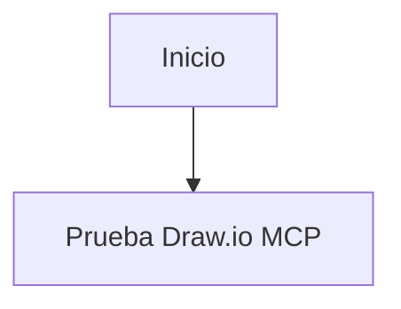

# Ejercicio 02 - Instalar draw.io MCP y la skill `architecture-diagram-generator` en Claude Code

## Objetivo

Instalar en Claude Code:

- el MCP oficial de draw.io
- la skill `architecture-diagram-generator`

Luego usar ambas capacidades para:

1. leer el documento [arquitectura.md](/Users/agus/local/lab/bigdataybi/ia-dataengineering/13-introduccion-mcp/practice/arquitectura.md)
2. diseñar una arquitectura de datos basada en ese documento usando la skill
3. generar un diagrama técnico en HTML con la skill
4. crear en draw.io el diagrama de esa misma arquitectura diseñada usando el MCP

## Documento base del ejercicio

El insumo principal de este laboratorio es el archivo:

- `13-introduccion-mcp/practice/arquitectura.md`

Ese documento describe una arquitectura tipo Medallion y debe ser la base para todo el ejercicio.

La idea no es inventar una arquitectura distinta, sino:

1. leer y entender el contenido de `arquitectura.md`
2. usar la skill `architecture-diagram-generator` para diseñar el diagrama de esa arquitectura
3. usar el MCP `drawio` para crear el diagrama visual de la arquitectura ya diseñada

## Duración sugerida

40 a 60 minutos

## Referencias oficiales

- Skill: [Cocoon-AI/architecture-diagram-generator](https://github.com/Cocoon-AI/architecture-diagram-generator/tree/main)
- MCP: [jgraph/drawio-mcp](https://github.com/jgraph/drawio-mcp)

## Parte A - Instalar la skill en Claude Code

Para este laboratorio, la forma más simple es instalar la skill localmente dentro del proyecto.

La ruta recomendada es:

- `.claude/skills/architecture-diagram/`

Puedes lograrlo de cualquiera de estas formas:

- copiando la carpeta `architecture-diagram/` del repositorio de la skill
- extrayendo `architecture-diagram.zip` dentro de `.claude/skills/`

### Estructura mínima esperada

```text
.claude/
└── skills/
    └── architecture-diagram/
        ├── SKILL.md
        └── resources/
            └── template.html
```

## Parte B - Instalar el MCP de draw.io en Claude Code

Usa el comando:

```bash
claude mcp add drawio -- npx -y @drawio/mcp
```

Si quieres revisar la configuración, Claude Code también puede declarar el servidor en:

- `.claude/settings.json`

## Parte C - Verificar el MCP en Claude Code

Después de agregarlo, puedes revisar el estado con:

```text
/mcp
```

Haz una prueba mínima:

````markdown
Usa la herramienta `open_drawio_mermaid` para abrir este diagrama:


````

Si esta prueba funciona, el MCP está operativo.

## Parte D - Revisar el documento de arquitectura

Antes de usar la skill, abre y revisa:

- `13-introduccion-mcp/practice/arquitectura.md`

Debes identificar al menos:

- objetivo de la arquitectura
- capas principales `bronze`, `silver` y `gold`
- propósito de cada capa
- ventajas, desventajas y recomendaciones

## Parte E - Diseñar la arquitectura con la skill

Una forma clara de usar la skill es mencionarla explícitamente en el prompt.

### Prompt base sugerido

```markdown
Usa la skill `architecture-diagram` para leer el archivo `13-introduccion-mcp/practice/arquitectura.md` y, basándote en ese contenido, diseñar un diagrama técnico de la arquitectura descrita allí.

Quiero que:

- uses el documento como fuente principal de contexto
- representes claramente las capas `bronze`, `silver` y `gold`
- reflejes el ciclo de vida de los datos y el propósito de cada capa
- generes un archivo `.html` autocontenido con un diagrama técnico profesional
- no inventes componentes ajenos al documento salvo que los marques explícitamente como apoyo visual
```

## Parte F - Diagramar la misma arquitectura en draw.io con MCP

Después de tener clara la arquitectura y de haber generado el HTML con la skill, pide a Claude Code que represente esa misma arquitectura diseñada en draw.io usando Mermaid.

### Prompt base sugerido

```markdown
# Rol
Actúa como un arquitecto de datos.

# Objetivo
Usa la herramienta `open_drawio_mermaid` del MCP `drawio` para crear un diagrama de la arquitectura descrita en `13-introduccion-mcp/practice/arquitectura.md`.

# Contexto
Primero toma como base el contenido de `13-introduccion-mcp/practice/arquitectura.md` y el diseño de arquitectura que ya generaste con la skill `architecture-diagram`.

# Arquitectura a representar
- debe reflejar la arquitectura Medallion descrita en el documento
- debe mostrar claramente las capas `bronze`, `silver` y `gold`
- debe representar el flujo progresivo de los datos entre capas
- debe enfatizar el propósito de calidad, validación y consumo analítico

# Requisitos
- usa un Mermaid claro y legible
- abre el resultado con draw.io para revisión
- no inventes relaciones que contradigan el documento base
```

## Parte G - Revisar ambos resultados

Debes validar dos entregables:

- el archivo `.html` generado con la skill
- el diagrama abierto mediante draw.io MCP

Revisa:

- si ambos entregables están realmente basados en `arquitectura.md`
- si la arquitectura es coherente con el documento fuente
- si las capas `bronze`, `silver` y `gold` aparecen correctamente
- si el diagrama de draw.io refleja la misma lógica del HTML generado por la skill
- si el resultado es claro para otra persona del equipo

## Entregable

El estudiante debe presentar:

1. evidencia de la carpeta `.claude/skills/architecture-diagram/`
2. evidencia de instalación del MCP `drawio` en Claude Code
3. evidencia de la prueba mínima del MCP
4. evidencia de uso del archivo `13-introduccion-mcp/practice/arquitectura.md`
5. el prompt usado para la skill
6. el archivo `.html` resultante
7. el prompt usado para draw.io MCP
8. el diagrama generado en draw.io

## Criterio de éxito

El ejercicio está completo si el estudiante logra:

- instalar la skill `architecture-diagram-generator` en Claude Code
- instalar el MCP `drawio` en Claude Code
- validar el uso de `open_drawio_mermaid`
- generar un diagrama técnico en HTML basado en `arquitectura.md`
- diagramar la misma arquitectura diseñada en draw.io
