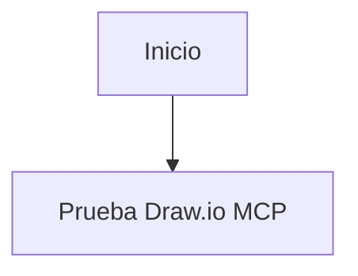

# Ejercicio 02 - Instalar draw.io MCP y la skill `architecture-diagram-generator` en Claude Code

## Objetivo

Instalar en Claude Code:

- el MCP oficial de draw.io
- la skill `architecture-diagram-generator`

Luego usar ambas capacidades para:

1. diseñar una arquitectura de datos
2. generar un diagrama técnico en HTML con la skill
3. abrir y diagramar la misma arquitectura en draw.io usando el MCP

## Caso de arquitectura sugerido

Para este laboratorio, usa una arquitectura de ciclo de vida de datos con estos componentes:

- Oracle como sistema fuente
- Spark para ingesta y procesamiento
- capas `raw`, `bronze`, `silver` y `gold`
- Airflow como orquestador opcional
- Power BI como capa de consumo analítico

## Duración sugerida

40 a 60 minutos

## Referencias oficiales

- Skill: [Cocoon-AI/architecture-diagram-generator](https://github.com/Cocoon-AI/architecture-diagram-generator/tree/main)
- MCP: [jgraph/drawio-mcp](https://github.com/jgraph/drawio-mcp)

## Parte A - Instalar la skill en Claude Code

Para este laboratorio, la forma más simple es instalar la skill localmente dentro del proyecto.

La ruta recomendada es:

- `.claude/skills/architecture-diagram/`

Puedes lograrlo de cualquiera de estas formas:

- copiando la carpeta `architecture-diagram/` del repositorio de la skill
- extrayendo `architecture-diagram.zip` dentro de `.claude/skills/`

### Estructura mínima esperada

```text
.claude/
└── skills/
    └── architecture-diagram/
        ├── SKILL.md
        └── resources/
            └── template.html
```

## Parte B - Instalar el MCP de draw.io en Claude Code

Usa el comando:

```bash
claude mcp add drawio -- npx -y @drawio/mcp
```

Si quieres revisar la configuración, Claude Code también puede declarar el servidor en:

- `.claude/settings.json`

## Parte C - Verificar el MCP en Claude Code

Después de agregarlo, puedes revisar el estado con:

```text
/mcp
```

Haz una prueba mínima:

````markdown
Usa la herramienta `open_drawio_mermaid` para abrir este diagrama:


````

Si esta prueba funciona, el MCP está operativo.

## Parte D - Diseñar la arquitectura con la skill

Una forma clara de usar la skill es mencionarla explícitamente en el prompt.

### Prompt base sugerido

```markdown
Usa la skill `architecture-diagram` para diseñar una arquitectura de datos con estas características:

- Oracle como fuente transaccional
- Spark para ingesta desde Oracle
- capa `raw` como landing inicial
- capa `bronze` para estandarización inicial
- capa `silver` para limpieza y validación
- capa `gold` para datasets analíticos
- Power BI como consumo final
- Airflow como orquestador opcional

Quiero que generes un archivo `.html` autocontenido con un diagrama técnico profesional.
```

## Parte E - Diagramar la misma arquitectura en draw.io con MCP

Después de tener clara la arquitectura, pide a Claude Code que represente ese mismo diseño en draw.io usando Mermaid.

### Prompt base sugerido

```markdown
# Rol
Actúa como un arquitecto de datos.

# Objetivo
Usa la herramienta `open_drawio_mermaid` del MCP `drawio` para abrir un diagrama de arquitectura.

# Arquitectura a representar
- Oracle es la fuente
- Spark realiza ingesta y procesamiento
- el flujo pasa por `raw`, `bronze`, `silver` y `gold`
- Power BI consume la capa `gold`
- Airflow puede aparecer como orquestador del flujo

# Requisitos
- usa un Mermaid claro y legible
- organiza visualmente source, processing y consumption
- abre el resultado con draw.io para revisión
```

## Parte F - Revisar ambos resultados

Debes validar dos entregables:

- el archivo `.html` generado con la skill
- el diagrama abierto mediante draw.io MCP

Revisa:

- si la arquitectura es coherente
- si Oracle, Spark, `raw`, `bronze`, `silver`, `gold` y Power BI aparecen correctamente
- si el diagrama de draw.io refleja la misma lógica del HTML
- si el resultado es claro para otra persona del equipo

## Entregable

El estudiante debe presentar:

1. evidencia de la carpeta `.claude/skills/architecture-diagram/`
2. evidencia de instalación del MCP `drawio` en Claude Code
3. evidencia de la prueba mínima del MCP
4. el prompt usado para la skill
5. el archivo `.html` resultante
6. el prompt usado para draw.io MCP
7. el diagrama generado en draw.io

## Criterio de éxito

El ejercicio está completo si el estudiante logra:

- instalar la skill `architecture-diagram-generator` en Claude Code
- instalar el MCP `drawio` en Claude Code
- validar el uso de `open_drawio_mermaid`
- generar un diagrama técnico en HTML
- diagramar la misma arquitectura en draw.io
