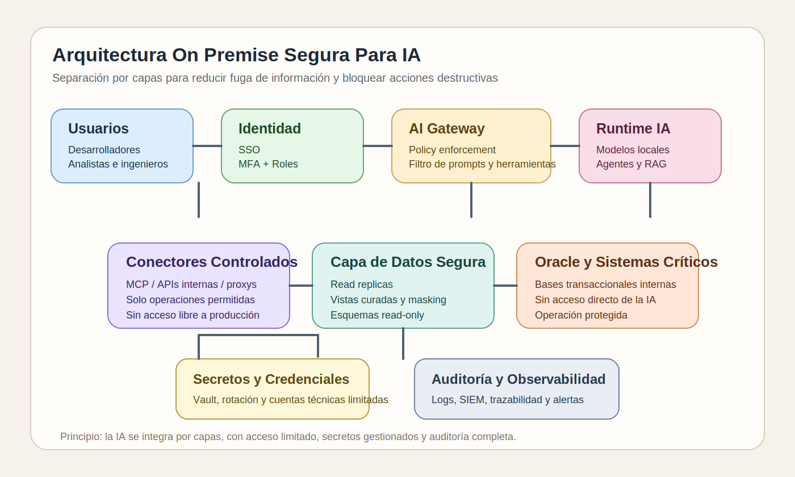
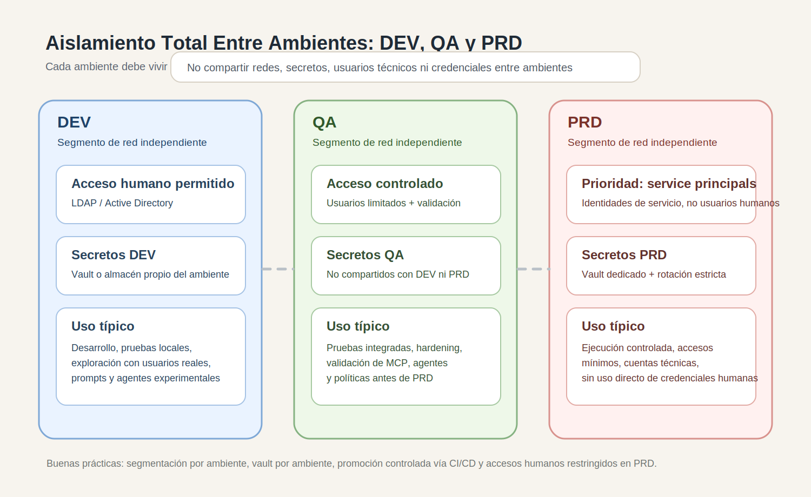
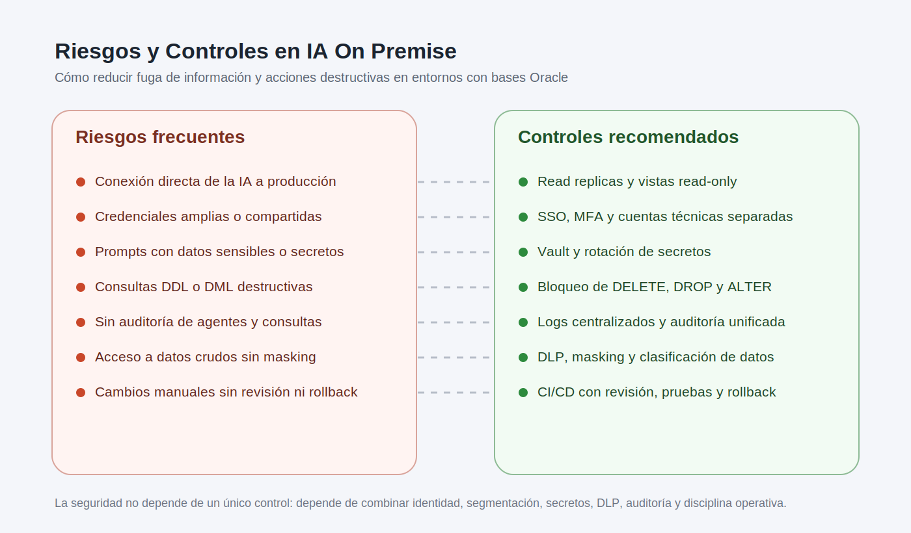
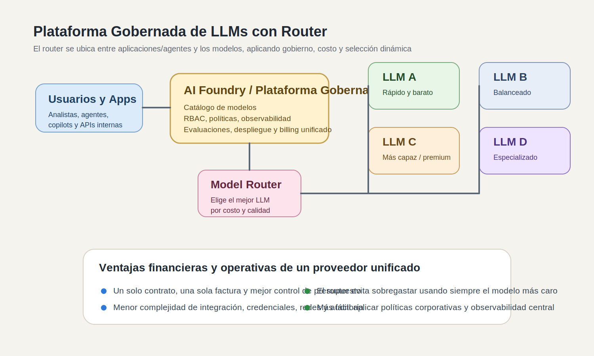
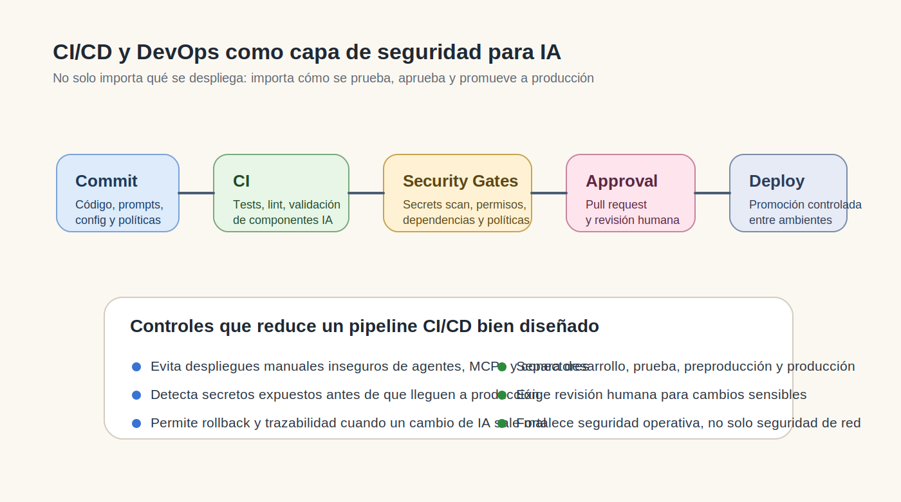

# Teoría - Módulo 16

## 1. Escenario base

Este módulo parte de una empresa con estas características:

- infraestructura principalmente **on premise**
- bases de datos transaccionales internas, especialmente **Oracle**
- equipos de desarrollo, análisis e ingeniería de datos conectándose con autenticación básica
- interés en incorporar IA para acelerar tareas técnicas y analíticas

El problema es que, si se conecta IA sin rediseñar la arquitectura, aparecen riesgos graves:

- fuga de información sensible
- uso de credenciales excesivas
- ejecución de consultas destructivas
- borrado de datos o estructuras
- exposición accidental de esquemas, tablas o secretos

## 2. Principio central: la IA no debe hablar directo con los sistemas críticos

Uno de los errores más peligrosos es permitir que un chat, agente o servicio de IA se conecte directamente a una base transaccional con credenciales amplias.

La regla práctica debe ser:

- la IA no accede directamente a producción
- la IA no usa credenciales personales del usuario
- la IA no hereda privilegios de DBA o de desarrollo sin control

## 3. Componentes mínimos de una arquitectura on premise segura para IA

### 3.1 Zona de acceso de usuarios

Aquí viven:

- desarrolladores
- analistas de datos
- ingenieros de datos
- científicos de datos

Esta zona debería integrarse con:

- directorio corporativo
- SSO
- MFA
- roles por perfil

## 3.2 Gateway o AI Access Layer

En lugar de dejar que cada usuario conecte su herramienta de IA directamente a todo, conviene tener una capa intermedia de acceso.

Esta capa puede incluir:

- proxy de peticiones a modelos
- filtrado de prompts
- control de herramientas habilitadas
- DLP básico
- trazabilidad de solicitudes

## 3.3 Zona de inferencia o AI Runtime

Aquí viven:

- modelos locales
- gateways de inferencia
- servicios RAG
- agentes corporativos

Esta zona debe estar separada de:

- la red de usuario
- la red transaccional
- internet abierto

## 3.4 Capa de integración de datos

La IA no debería usar directamente las bases transaccionales como fuente primaria de interacción.

Conviene incorporar:

- réplicas de lectura
- vistas controladas
- esquemas sanitizados
- capas semánticas
- servicios API internos

## 3.5 Gestión de secretos

Nunca se deben usar credenciales hardcodeadas en:

- prompts
- notebooks
- scripts
- archivos compartidos

Se necesita una capa de secretos, por ejemplo:

- vault corporativo
- rotación de credenciales
- secretos por servicio
- tokens de corta duración si es posible

## 3.6 Observabilidad y auditoría

Toda arquitectura segura para IA necesita registrar:

- quién hizo la solicitud
- qué herramienta o agente se usó
- qué datos intentó consultar
- qué consultas se ejecutaron
- qué resultados o acciones produjo la IA

Esto debe integrarse idealmente con:

- logs centralizados
- SIEM
- alertas de seguridad
- auditoría de base de datos

## 4. Controles clave sobre bases de datos Oracle

En un entorno Oracle on premise, hay varios controles que ayudan mucho:

- cuentas separadas por función
- privilegios mínimos
- esquemas de solo lectura para consumo por IA
- auditoría unificada
- bloqueo de DDL/DML destructivo para cuentas de IA
- vistas o sinónimos limitados en lugar de acceso amplio a tablas

La lógica recomendada es:

- usuarios humanos siguen con su identidad corporativa
- la IA usa cuentas técnicas específicas y restringidas
- las cuentas técnicas de IA no tienen privilegios de borrado, alteración o administración

## 5. Qué componentes adicionales conviene incorporar

En una arquitectura madura, conviene considerar también:

- segmentación de red
- jump server o bastion para administración
- EDR en servidores de IA
- proxy saliente controlado
- repositorio interno de modelos o artefactos
- escaneo de paquetes y dependencias
- aprobación humana para tareas sensibles

## 6. Patrones recomendados de acceso a datos para IA

### Patrón 1 - Read replica

La IA consulta una réplica de lectura y no la base transaccional primaria.

### Patrón 2 - Semantic layer

La IA consulta una capa curada de vistas o data marts, no tablas operativas crudas.

### Patrón 3 - API interna controlada

La IA no ve SQL ni credenciales. Solo consume una API interna con operaciones permitidas.

### Patrón 4 - Sandbox de ejecución

Los agentes pueden analizar, sugerir o generar artefactos, pero no ejecutar acciones destructivas sin aprobación.

## 7. Controles específicos contra fuga de información

Para reducir riesgo de fuga conviene aplicar:

- clasificación de datos
- enmascaramiento o redacción
- tokenización en datos sensibles
- filtros de salida
- políticas de copia/descarga
- revisión de prompts y salidas
- segmentación de entornos

La idea no es confiar solo en el modelo, sino en la arquitectura y en los controles que la rodean.

## 8. Controles específicos contra borrado o cambios destructivos

La IA no debería poder:

- ejecutar `DELETE`, `DROP`, `TRUNCATE`, `ALTER`
- crear usuarios
- modificar permisos
- lanzar jobs administrativos

Para eso se recomienda:

- cuentas read-only para exploración
- separación entre análisis y operación
- listas permitidas de comandos
- aprobación humana para cambios
- entornos separados para pruebas

## 9. Diseño recomendado por capas

Una arquitectura segura para IA on premise podría verse así:

1. **usuarios corporativos**
2. **SSO / IAM / MFA**
3. **AI Gateway / Policy Enforcement**
4. **Agentes / Modelos / RAG**
5. **Conectores seguros / MCP / APIs internas**
6. **réplicas, vistas curadas y capas semánticas**
7. **bases transaccionales**
8. **logging, auditoría y SIEM**

## 10. Importancia de usar una plataforma gobernada para orquestar LLMs

Cuando una empresa empieza a usar varios LLMs, aparece un problema adicional: no solo hay que gobernar el acceso a los datos, también hay que gobernar **qué modelo se usa, por qué se usa, cuánto cuesta y bajo qué políticas**.

Por eso conviene usar una plataforma centralizada del estilo de **Azure AI Foundry** o equivalentes.

Estas plataformas ayudan a:

- centralizar el catálogo de modelos
- aplicar RBAC y políticas
- auditar consumo y trazabilidad
- desplegar endpoints de forma controlada
- evaluar modelos de forma comparativa
- concentrar facturación y observabilidad

### 10.1 El rol del router de modelos

Un **router de modelos** se ubica entre las aplicaciones o agentes y los distintos LLMs disponibles.

Su función es decidir qué modelo conviene usar para cada solicitud según criterios como:

- calidad esperada de respuesta
- costo
- latencia
- políticas de negocio
- disponibilidad del modelo

En Azure AI Foundry existe el concepto de **model router** como un despliegue que selecciona el mejor LLM en tiempo real. En Amazon Bedrock existe **intelligent prompt routing**, que enruta entre modelos de una misma familia para optimizar calidad y costo.

### 10.2 ¿Dónde se ubica el router en la arquitectura?

El punto importante es que:

- las aplicaciones no deberían decidir directamente qué LLM usar en cada llamada
- el router debe estar dentro de la capa gobernada de IA
- la plataforma central debe aplicar seguridad, políticas y observabilidad antes de llegar al modelo

### 10.3 Ventajas financieras de un proveedor unificado

En términos prácticos, usar una plataforma centralizada con un solo proveedor suele traer ventajas como:

- una sola relación contractual
- una sola factura o plano principal de cobro
- menor complejidad de redes, claves y auditoría
- más facilidad para controlar presupuestos y consumo
- menos integración manual entre múltiples vendors

Además, si existe router de modelos, se evita usar siempre el modelo más caro para todas las tareas.

Esto puede generar ahorro porque:

- tareas simples pueden ir a modelos más baratos
- tareas complejas pueden ir a modelos más potentes solo cuando hace falta
- la organización evita pagar de más por una estrategia fija de “todo al mejor modelo”

Esto último es una **inferencia práctica de arquitectura y finanzas**, basada en los beneficios oficiales de routing y de plataformas unificadas, no una promesa universal de ahorro en todos los casos.

### 10.4 Equivalentes aproximados a Azure AI Foundry

La siguiente tabla resume equivalentes aproximados. No son idénticos uno a uno, pero cumplen un rol parecido como plataforma gobernada para catálogo, despliegue y operación de modelos.

| Plataforma | Tipo | Rol equivalente aproximado | Router nativo o similar | Comentario |
| --- | --- | --- | --- | --- |
| Azure AI Foundry | Nube | Plataforma unificada de modelos, agentes, tools y gobierno | Sí, `model router` | Fuerte integración con RBAC, políticas y despliegues en Azure |
| Amazon Bedrock | Nube | Capa gestionada para consumir múltiples foundation models | Sí, `intelligent prompt routing` | Muy orientado a consumo gobernado de modelos desde AWS |
| Google Vertex AI | Nube | Plataforma unificada para GenAI y ML con catálogo de modelos | No encontré en fuentes revisadas un router equivalente tan explícito como Azure/Bedrock | Su fuerza está en la plataforma unificada y Model Garden |
| IBM watsonx.ai | Nube / híbrido | Plataforma de construcción y operación de soluciones de IA con enfoque empresarial | No confirmé un router equivalente en las fuentes revisadas | Fuerte foco en gobierno y operación empresarial |
| OCI Generative AI | Nube | Servicio gestionado de IA generativa en Oracle Cloud | No confirmé un router equivalente en las fuentes revisadas | Relevante para ecosistemas Oracle empresariales |
| Red Hat OpenShift AI Self-Managed | On-prem / híbrido | Plataforma para desarrollar, servir y monitorear AI/ML sobre OpenShift | No es un router de LLM gestionado | Útil cuando la empresa necesita mayor control on-prem o híbrido |
| IBM watsonx.ai software | On-prem / híbrido | Variante de watsonx.ai desplegable sobre plataforma empresarial | No confirmé un router equivalente en las fuentes revisadas | Apropiado para escenarios con mayor control de infraestructura |

## 11. Uso de proxies, gateways y guardrails antes de enviar prompts a un LLM

Sí existe en el mercado una categoría de herramientas que se coloca **delante del LLM** para inspeccionar prompts y respuestas antes de que lleguen al modelo o antes de que vuelvan al usuario.

Estas soluciones pueden aparecer como:

- `AI gateway`
- `LLM proxy`
- `prompt firewall`
- `guardrails`

No todas son exactamente iguales, pero cumplen funciones parecidas:

- inspeccionar el prompt
- detectar prompt injection o jailbreaks
- detectar PII, secretos o datos sensibles
- aplicar políticas
- bloquear o redactar contenido
- registrar auditoría

### 11.1 Dónde se ubican en la arquitectura

### 11.2 Utilidad práctica

Estas herramientas son especialmente útiles cuando la empresa quiere:

- evitar que prompts con datos sensibles salgan hacia un LLM en la nube
- bloquear intentos de prompt injection
- centralizar políticas de seguridad para varias aplicaciones
- aplicar redacción automática de PII o secretos
- tener trazabilidad unificada sobre prompts y respuestas

### 11.3 Tabla de proveedores y soluciones

La siguiente tabla mezcla proveedores nativos de nube y vendors especializados. No todos son “proxy drop-in” en el mismo sentido, pero todos cumplen un rol de control previo o intermedio en el uso de LLMs.

| Solución | Tipo | Uso principal | Utilidad práctica |
| --- | --- | --- | --- |
| PromptGuard | Prompt firewall / proxy de seguridad | Se ubica entre la app y el LLM para escanear requests y responses | Bloquea prompt injection, jailbreaks, data leaks, PII y aplica políticas en tiempo real |
| Portkey AI Gateway + Guardrails | AI gateway | API unificada para múltiples LLMs con routing y guardrails | Centraliza acceso, routing, observabilidad, presupuestos y políticas de seguridad |
| Amazon Bedrock Guardrails | Guardrails gestionados | Evalúa prompts y respuestas dentro del ecosistema Bedrock | Filtra PII, temas denegados, contenido riesgoso y ayuda a gobernar aplicaciones GenAI en AWS |
| Azure AI Content Safety + Prompt Shields | Safety layer | Analiza texto e inputs para detectar contenido dañino y ataques a LLMs | Útil para filtrar ataques de prompt y contenido riesgoso dentro de entornos Azure |
| Vertex AI safety filters | Safety layer | Filtra contenido inseguro y políticas de salida dentro de Vertex AI | Ayuda a moderar prompts y respuestas, aunque no es un proxy de seguridad dedicado como gateway externo |
| Lakera | AI security / AI firewall | Protección runtime para apps y agentes de IA | Detecta prompt attacks, data leakage y aplica políticas centralizadas; útil en despliegues empresariales |

### 11.4 Cómo elegir

En la práctica:

- si quieres una **capa de acceso unificada** para varios modelos, suele convenir un `AI gateway`
- si quieres una **capa fuerte de seguridad de prompts y respuestas**, suele convenir un `prompt firewall` o solución de `AI security`
- si ya estás estandarizado en una nube, puede ser suficiente empezar con los **guardrails nativos** del proveedor

### 11.5 Recomendación para entornos on premise con alto riesgo

Para una empresa on premise con bases Oracle y fuerte preocupación por fuga de datos, una arquitectura razonable sería combinar:

- una plataforma gobernada de modelos
- un gateway o router
- una capa de guardrails o proxy de seguridad
- DLP y clasificación de datos
- conectores a datos estrictamente limitados

Es decir: no confiar en un solo control, sino en defensa en profundidad.

## 12. Qué no debería hacerse

Evita diseños como estos:

- conectar ChatGPT o un agente directo a producción con un usuario técnico amplio
- compartir usuarios genéricos entre personas y herramientas
- guardar passwords en notebooks o prompts
- permitir que la IA ejecute SQL libre contra producción
- no registrar qué hizo el agente

## 13. Importancia de introducir CI/CD y DevOps para mejorar la seguridad

Cuando una empresa empieza a incorporar IA, no basta con asegurar la red o las bases de datos. También hay que asegurar la forma en que se despliegan:

- agentes
- prompts
- conectores
- MCPs
- notebooks
- scripts
- configuraciones de acceso

Aquí es donde prácticas de **CI/CD** y **DevOps** ayudan mucho.

### 11.1 ¿Por qué CI/CD mejora la seguridad?

Un pipeline de integración y despliegue permite que los cambios no lleguen directamente a producción sin control.

Eso ayuda a:

- revisar cambios antes de publicarlos
- validar configuraciones
- ejecutar pruebas automáticas
- detectar secretos expuestos
- escanear dependencias vulnerables
- registrar quién aprobó un despliegue

En un entorno con IA, esto es especialmente importante porque:

- un cambio pequeño en prompts, herramientas o permisos puede ampliar riesgos
- un conector mal configurado puede exponer datos
- un MCP o agente nuevo puede quedar con privilegios excesivos

### 11.2 Qué prácticas DevOps conviene introducir

Conviene incorporar al menos:

- control de versiones para prompts, políticas, configuraciones y código
- ramas y pull requests con revisión
- despliegues por ambientes
- validación automática antes de liberar cambios
- rollback controlado
- trazabilidad de cambios

### 11.3 Qué validaciones automáticas deberían existir

Antes de desplegar componentes de IA o conectores a datos, conviene validar:

- escaneo de secretos
- análisis de dependencias
- revisión de configuraciones sensibles
- validación de permisos
- pruebas sobre conectividad a datos
- pruebas de políticas o listas permitidas

### 11.4 Ambientes separados

Una práctica clave es separar:

- desarrollo
- prueba
- preproducción
- producción

La IA nunca debería pasar de una prueba interna a un acceso sensible de producción sin un proceso controlado de promoción.

### 11.5 Beneficio principal

CI/CD y DevOps no solo aceleran cambios. También reducen el riesgo de:

- errores manuales
- configuraciones inseguras
- credenciales expuestas
- despliegues no auditados
- componentes de IA sin revisión

## 14. Qué se aprende realmente en este módulo

Más allá de seguridad teórica, este módulo enseña a pensar la IA como parte de una arquitectura empresarial.

Eso implica diseñar:

- límites
- zonas
- controles
- identidades
- capacidades permitidas y prohibidas

## 15. Ideas clave para llevarse

- la IA debe integrarse por capas, no por acceso directo
- el control de identidad y secretos es tan importante como el modelo
- el acceso a datos debe pasar por mecanismos limitados y auditables
- una buena arquitectura reduce tanto fuga de información como acciones destructivas
- CI/CD y DevOps ayudan a que la seguridad también exista en el proceso de cambio y despliegue
- una plataforma gobernada con router puede mejorar control operativo, seguridad y eficiencia de consumo
- un proxy o firewall de prompts puede reducir mucho el riesgo antes de llegar al LLM
